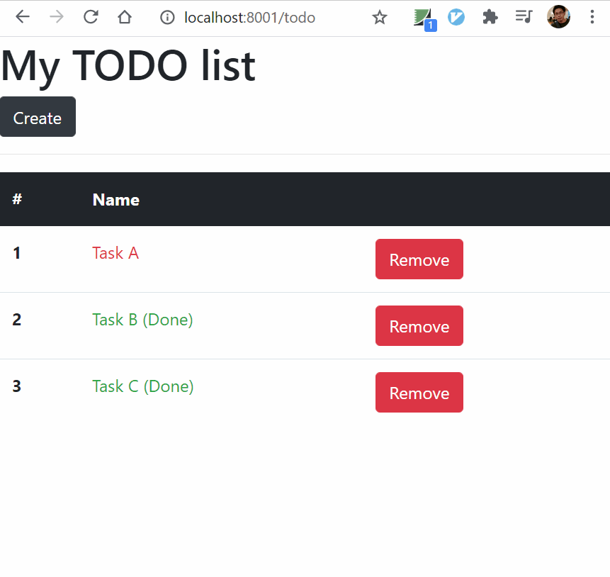
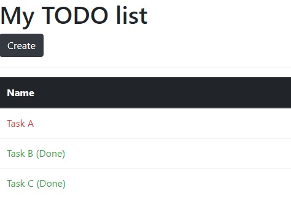
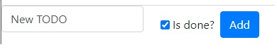

# Todo Website

In this tutorail, we will use [http package](https://golang.org/pkg/net/http/) to create a TODO list website that can

- List done and undone TODOs
- Create new TODO
- Remove a TODO


The full source code is at my [Github](https://github.com/KarateJB/Go.Samples/tree/master/Samples/03.net-http).


# Files Structure

The final files structure will be like this,

```s
├── go.mod
├── header.html
├── server.go # The main module 
├── todo-create.html
├── todo-list.html
└── types
   ├── go.mod
   └── types.go
```


# Get started with a simple website


## Serve specified URL path with a handler

Lets get started with simple example that can response current URL path.


---
`server.go`

```go
package main

import (
    "fmt"
    "log"
	"net/http"
)

func main() {
	http.HandleFunc("/", handler) // The "/" matches anything not handled elsewhere.
	log.Fatal(http.ListenAndServe("localhost:8001", nil)) // Listen on localhost:8001
}

func handler(rw http.ResponseWriter, req *http.Request) {
	rw.WriteHeader(http.StatusOK)

	// Use http.ResponseWriter
	// rw.Write([]byte(`My website`))

	// Or use fmt.Fprintf
	fmt.Fprintf(rw, "Welcome, your current URL.Path = %q\n", req.URL.Path)
}
```

> Notice that `HandleFunc` registers the handler function for the given URL pattern.

Now run with

```s
$ go mod init server
$ go run server.go
```

And browse to any path of `http://localhost:8001`, such as `http://localhost:8001/test/anypath/`, we will get the response:


## Response HTML

Now we want to response HTML. The following sample code shows how to response HTML that display a counter for every request.

---
`server.go`

```go
package main

import (
	"fmt"
	"log"
	"net/http"
	"strconv"
)

var counter int

func main() {
	http.HandleFunc("/count", handlerCounter)  // "/count"
	http.HandleFunc("/count/", handlerCounter) // "/count/xxxx"
	log.Fatal(http.ListenAndServe("localhost:8001", nil))
}

func handlerCounter(rw http.ResponseWriter, req *http.Request) {
	counter++
	rw.WriteHeader(http.StatusOK)
	html := `<!DOCTYPE html>
			<html>
			<head><title>My counter</title></head>
			<body><h2>Counter = ` + strconv.Itoa(counter) + `</h2></body>
			</html>`
	rw.Write([]byte(html))
}
```


# Do more with TODO List/Create/Remove

We will learn how to create a website that can list/create/remove TODO tasks.

The final result will be like this,




## TODO List

Here are the steps to list our TODOs

1. Create struct types for TODO data.
2. Create HTML templates.
3. Use [text/template](https://golang.org/pkg/text/template/) to render HTML templates and show TODO list.

> - Package [text/template](https://golang.org/pkg/text/template/) implements data-driven templates for generating textual output.


### 1. Create struct types for TODO data


---
`types/types.go`

```go
package types

// Todo is a todo task
type Todo struct {
	Title  string
	IsDone bool
}

// TodoPageData contains todo title and tasks
type TodoPageData struct {
	PageTitle string
	Todos     []Todo
}
```

Dont forget to `go mod init types`.


### 2. Create HTML templates.

In this step, we will create the HTML templates:

| HTML file | Description |
|:----------|:------------|
| header.html | Define the HTML head, which links the external resource: bootstrap. |
| todo-list.html | Define the HTML body that shows the TODO list |


---
`header.html`

```html
{{define "header"}}
<!DOCTYPE html>
<html>
<head>
    <title>My website</title>
    <link rel="stylesheet" href="https://maxcdn.bootstrapcdn.com/bootstrap/4.0.0/css/bootstrap.min.css" />
</head>
{{end}}
```


---
`todo-list.html`

This template includes `header.html` as the HTML head.

```html
{{template "header" .}}
<body>
  <div class="content">
    <h1>{{.PageTitle}}</h1>
    <a href="/todo/create" class="btn btn-dark" role="button">Create</a>
    <hr />
    <table class="table">
      <thead class="thead-dark">
        <tr>
          <th>Name</th>
        </tr>
      </thead>
      <tbody>
        {{range $i, $t := .Todos}}
        <tr>
          {{if .IsDone}}
          <td class="text-success">{{.Title}} (Done)</td>
          {{else}}
          <td class="text-danger">{{.Title}}</td>
          {{end}}
        </tr>
        {{end}}
      </tbody>
    </table>
  </div>
</body>
```


### 3. Use text/template to render HTML templates and show TODO list


We will

- Import the dependency module: `types` and packages into `server.go`.
- Use global variable, `myTodoList`, to store the TODOs.
- Use [text/template](https://golang.org/pkg/text/template/) to render templates.
  - [New](https://golang.org/pkg/text/template/#New) — allocates new, undefined template with given name.
  - [ParseFiles](https://golang.org/pkg/text/template/#ParseFiles) — parses the named files and return parsed template,
  - [Must](https://golang.org/pkg/text/template/#Must) — Must is a helper that wraps a call to a function returning (*Template, error).
  - [Execute](https://golang.org/pkg/text/template/#Template.Execute) — applies a parsed template to the specified data object, and writes the output to response writer.


Import the `types/types.go` module with the following command,

```s
$ go mod edit -replace "types = ./types"
$ go mod edit -require types@1.1.0
```


---
`server.go`

```go
package main

import (
	"fmt"
	"log"
	"net/http"
	"strconv"
	"text/template"
)

var counter int
var myTodoList types.TodoPageData

func main() {
	myTodoList = types.TodoPageData{
		PageTitle: "My TODO list",
		Todos: []types.Todo{
			{Title: "Task A", IsDone: false},
			{Title: "Task B", IsDone: true},
			{Title: "Task C", IsDone: true},
		},
	}

	http.HandleFunc("/todo", handlerTodoList)          // "/todo"
	log.Fatal(http.ListenAndServe("localhost:8001", nil))
}

func handlerTodoList(rw http.ResponseWriter, req *http.Request) {
	tmpl := template.Must(template.New("todo-list.html").ParseFiles("./header.html", "./todo-list.html"))
	tmpl.Execute(rw, myTodoList)
}
```

So far we can get the following TODO list on [http://localhost:8001/todo](http://localhost:8001/todo).




## TODO Create Page

Now we will have the create page of TODO by the following steps.

1. Create HTML template.
2. Setup the route and handler, the handler must support HttpGet and HttpPost methods.


### 1. Create HTML template

---
`todo-create.html`

```html
{{template "header" .}}
<body>
  <form class="form-inline" method="POST" action="/todo/create" autocomplete="off">
    <label class="sr-only" for="inlineFormInputName2">TODO</label>
    <input type="text" name="todo" class="form-control mb-4 mr-sm-4" placeholder="Enter something here..."
    />
    <div class="form-check mb-2 mr-sm-2">
        <input class="form-check-input" type="checkbox" name="isDone">
        <label class="form-check-label" for="inlineFormCheck">
            Is done?
        </label>
    </div>
    <button type="submit" class="btn btn-primary mb-2">Add</button>
  </form>
</body>
```

Dont forget to set the `name` tag for the form post controls. In this HTML template, we have two values to post back:

- `todo`
- `isDone`: only post back when the checkbox is checked.


### 2. Setup the route and handler, the handler must support HttpGet and HttpPost methods.

---
`server.go`

```go
package main

import (
	"fmt"
	"log"
	"net/http"
	"strconv"
	"text/template"
	"types"
)

var myTodoList types.TodoPageData

func main() {
	myTodoList = types.TodoPageData{
		PageTitle: "My TODO list",
		Todos: []types.Todo{
			{Title: "Task A", IsDone: false},
			{Title: "Task B", IsDone: true},
			{Title: "Task C", IsDone: true},
		},
	}

	http.HandleFunc("/todo", handlerTodoList)          // "/todo"
	http.HandleFunc("/todo/create", handlerTodoCreate) // "/todo/create"
	log.Fatal(http.ListenAndServe("localhost:8001", nil))
}

func handlerTodoCreate(rw http.ResponseWriter, req *http.Request) {
	switch req.Method {
	case "GET":
		tmpl := template.Must(template.New("todo-create.html").ParseFiles("./todo-create.html", "./header.html"))
		tmpl.Execute(rw, nil)
	case "POST":
		if err := req.ParseForm(); err != nil {
			fmt.Fprintf(rw, "ParseForm() err: %v", err)
			return
		}
		todo := req.FormValue("todo")
		isDone := req.FormValue("isDone") != "" // The value is "" when the checkbox not checked
		myTodoList.Todos = append(myTodoList.Todos, types.Todo{Title: todo, IsDone: isDone})
		http.Redirect(rw, req, "/todo", http.StatusSeeOther)
	default:
		rw.WriteHeader(http.StatusNotFound)
	}
}

// .. skip func handerTodoList
```

The key point is that we have to check the HttpMethod of the request on the `handlerTodoCreate` and do different thiings on different HttpMethods.

After a new TODO created, we use [http.Redirect](https://golang.org/pkg/net/http/#Redirect) to redirect to TODO list page.

Now we have the create page that adding new TODO to the our TODO list.




## Support removing a TODO on List Page

Furthermore, we will support removing a TODO from the list.
To keep what TODO we are going to delete, we will track the **index** of TODO.
So that we will know which TODO is exactly we want to remove from the list.

What we will do:

1. Show the serial number on TODO list.
2. Add [Remove] button to every TODO and use its index to track and remove it from the list.


#### 1. Show the serial number on TODO list

We can use the index: `$i` of an array as the serial number in template by

```html
{{range $i, $t := .Todos}}
<th scope="row">{{$i}}</th>
{{end}}
```

However, the index will start from 0 while we want the serial number can be start from 1.
So we will write a function: `inc`, that can increase a number by 1.

Then we will use [text/template](https://golang.org/pkg/text/template/)'s [Funcs](https://golang.org/pkg/text/template/#Template.Funcs) to add the [FuncMap](https://golang.org/pkg/text/template/#FuncMap) on `inc` function. So that we can call `inc` on template.

> - [FuncMap](https://golang.org/pkg/text/template/#FuncMap): is the type of the map defining the mapping from names to functions.
> - [Funcs](https://golang.org/pkg/text/template/#Template.Funcs): adds the elements of the argument map to the template's function map.

 
---
`server.go`

```go
// ...skip the exist code

func handlerTodoList(rw http.ResponseWriter, req *http.Request) {
	tmpl := template.Must(template.New("todo-list.html").Funcs(template.FuncMap{"inc": inc}).ParseFiles("./header.html", "./todo-list.html"))
	tmpl.Execute(rw, myTodoList)
}

// inc: increment by 1
func inc(i int) int {
	return i + 1
}
```

Now we can call `inc` as following,

```html
{{range $i, $t := .Todos}}
<th scope="row">{{inc $i}}</th>
{{end}}
```


### 2. Add [Remove] button to every TODO and use its index to track and remove it from the list

Lets put a [Remove] button(s) to TODO list, and set a hidden input to track the index of the item to remove from the list.


---
`todo-list.html`

```html
{{template "header" .}}
<body>
  <form method="POSt" action="/todo">
    <input type="hidden" id="removeId" name="removeId" />
    <div class="content">
      <h1>{{.PageTitle}}</h1>
      <a href="/todo/create" class="btn btn-dark" role="button">Create</a>
      <hr />
      <table class="table">
        <thead class="thead-dark">
          <tr>
            <th>#</th>
            <th>Name</th>
            <th></th>
          </tr>
        </thead>
        <tbody>
          {{range $i, $t := .Todos}}
          <tr>
            <th scope="row">{{inc $i}}</th>
            {{if .IsDone}}
            <td class="text-success">{{.Title}} (Done)</td>
            {{else}}
            <td class="text-danger">{{.Title}}</td>
            {{end}}
            <td>
              <button type="submit" class="btn btn-danger" onclick="setRemoveIndex('{{$i}}')">Remove</button>
            </td>
          </tr>
          {{end}}
        </tbody>
      </table>
    </div>
  </form>
</body>

<script lang="javescript">
  function setRemoveIndex(i) {
      document.getElementById("removeId").value = i;
  }
</script>
```

When a user click the [Remove] button, the hidden input will be set to the index of the TODO item ready to be removed, then the form will be submit and post back the `removeId` value to backend.

The TODO list page is now like this,


Now we have to handle the HttpPost request from TODO list page.


---
`server.go`

```go
// ...skip exist code

func handlerTodoList(rw http.ResponseWriter, req *http.Request) {
	switch req.Method {
	case "GET":
		tmpl := template.Must(template.New("todo-list.html").Funcs(template.FuncMap{"inc": inc}).ParseFiles("./header.html", "./todo-list.html"))
		tmpl.Execute(rw, myTodoList)
	case "POST":
		if err := req.ParseForm(); err != nil {
			fmt.Fprintf(rw, "ParseForm() err: %v", err)
			return
		}

		removeIndex, _ := strconv.Atoi(req.FormValue("removeId")) // Convert string to int

		todosNew := &(myTodoList.Todos)
		*todosNew = append((*todosNew)[:removeIndex], (*todosNew)[removeIndex+1:]...)
		http.Redirect(rw, req, "/todo", http.StatusSeeOther)
	default:
		rw.WriteHeader(http.StatusNotFound)
	}
}

// inc: increment by 1
func inc(i int) int {
	return i + 1
}
```

Finally, we have the TODO website that supports list/create/remove TODO items.


# Source Code

[karatejb/Go.Samples](https://github.com/KarateJB/Go.Samples/tree/master/Samples/03.net-http)


# Reference

- [Using Go Templates](https://blog.gopheracademy.com/advent-2017/using-go-templates/)