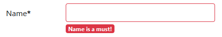

# Vue-form

> 表單驗證套件，支援Vue.js2.2以上的版本。

## Github

[fergaldoyle/vue-form](https://github.com/fergaldoyle/vue-form)


## 範例

例如表單上有一個必填欄位：`Name`，透過[vue-form](https://github.com/fergaldoyle/vue-form)，我們可以在實做當使用者未輸入任何值時，顯示提示訊息，並在輸入框上顯示不同的樣式。




### JS

```javascript
Vue.use(VueForm);

var app = new Vue({
    el: '#app',
    data: {
        me: { name: '', email: '' }, //my model
        formstate: {} //vue-form state
    },
    methods: {
        //Form validation class
        fieldClassName: function (field) {
            if (!field) {
                return '';
            }
            if ((field.$touched || field.$submitted) && field.$valid) {
                return 'is-valid'; //注意：is-valid為 Bootstrap 4的樣式
            }
            if ((field.$touched || field.$submitted) && field.$invalid) {
                return 'is-invalid'; //注意：is-invalid為 Bootstrap 4的樣式
            }
        }
    }
})
```

### HTML

```html
<div id="app">
    <vue-form :state="formstate" v-on:submit.prevent="submit">
       <label>Name*</label>
          <validate auto-label class="form-group required-field">
             <input type="text" name="name" required v-model="my.name" :class="fieldClassName(formstate.name)"/>
                <field-messages name="name" show="$touched || $submitted">
                   <span slot="required" class="badge badge-danger">Name is a must!</span>
                </field-messages>
           </validate>
    </vue-form>
</div>
```

[vue-form](https://github.com/fergaldoyle/vue-form)在HTML分三個組成：

1. `<vue-form>` 
2. `<validate>`
3. `<field-messages>`

### <vue-form>

定義表單的範圍


### <validate>

將表單輸入控制項放置於內，以啟用預設的驗證器


### <field-messages>

顯示對應的控制項驗證結果（提示訊息），可搭配如`show="$touched || $submitted"`等不同的欄位狀態來決定是否顯示不同的提示訊息；包含：

```
$dirty
$pristine
$valid
$invalid
$touched
$untouched
$focused
$submitted
$pending
```

## 內建驗證器

針對以下控制項的屬性可進行驗證：

* type="email"
* type="url"
* type="number"
* required
* minlength
* maxlength
* pattern
* min (for type="number")
* max (for type="number")


## 使用客製驗證器(Custom validator)

接下來我們要建立一個驗證使用者是否輸入已經重複的資料的Validator: `notDuplicateKey`，及其背後驗證的函式：`checkDuplicateKey`。

```javascript
Vue.use(VueForm);

var app = new Vue({
    el: '#app',
    data: {
        me: { name: '', email: '' }, //my model
        notDuplicateKey: true,
        formstate: {} //vue-form state
    },
    methods: {
        //Form validation class
        fieldClassName: function (field) {
            //Skip…
        },
        //Chekc if the key exists in backend
         checkDuplicateKey: function (event, key) {
            const keys = ['StarWars', 'GodFather', 'FightClub']
            return keys.includes(key);
        }
    }
})

```

使用方式： 

```html
<div id="app">
    <vue-form :state="formstate" v-on:submit.prevent="submit">
       <label>Name*</label>
          <validate auto-label class="form-group required-field" 
:custom="{'not-duplicate-key': notDuplicateKey}" >
             <input type="text" name="name" required v-model="my.name" :class="fieldClassName(formstate.name)"
                    v-on:blur="checkDuplicateKey($event, me.name)"/>
                <field-messages name="name" show="$touched || $submitted">
                   <span slot="required" class="badge badge-danger">Name is a must!</span>
                   <span slot="not-duplicate-key" class="badge badge-danger">Duplicate name!</span>
                </field-messages>
           </validate>
</vue-form>
</div>
```


### <validate>

`<validate :custom="{'not-duplicate-key': notDuplicateKey}"></validate>`

'not-duplicate-key'為field message對應的slot名稱。
且我們使用`notDuplicateKey`做為客製驗證器(custom validator)。 


### <field-messages>

`<span slot="not-duplicate-key" class="badge badge-danger">Duplicate name!</span>`

我們增加了一個field message來顯示`notDuplicateKey`驗證失敗資訊，其slot名稱為`not-duplicate-key`。


最後我們在輸入框的blur事件(blur event)檢核重複值：

`<input type="text" name="name" required v-model="my.name" :class="fieldClassName(formstate.name)" v-on:blur="checkDuplicateKey($event, me.name)" />`

若需要在使用者輸入一個字元即驗證，可使用keyup事件。


## Demo


