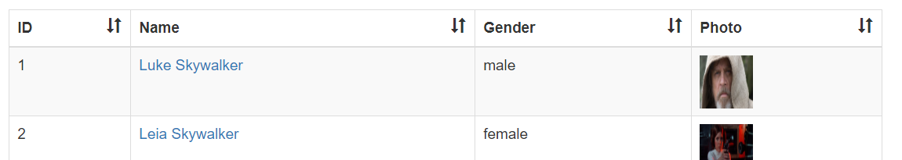
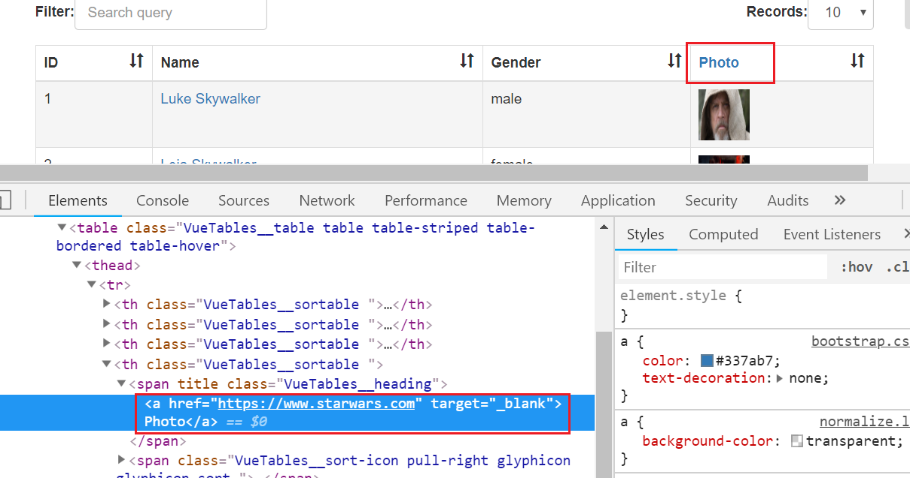
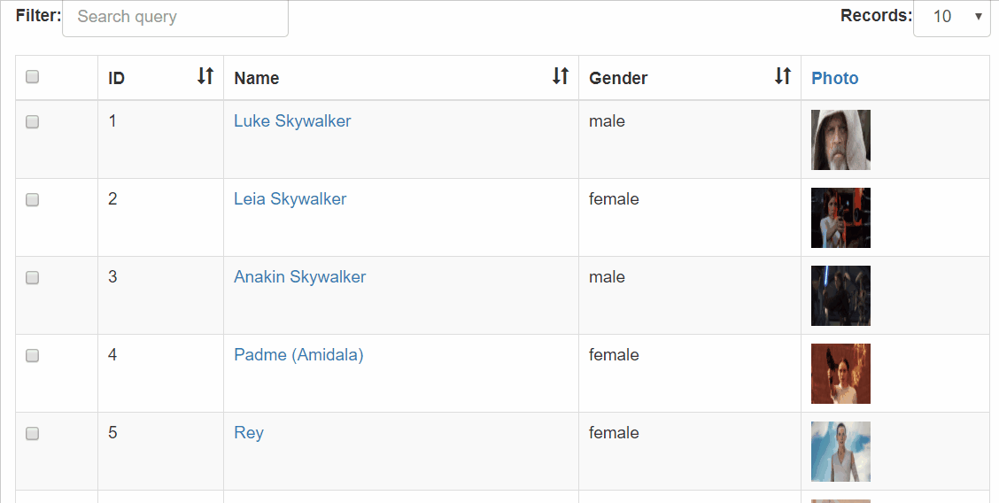

# vue-tables-2 (2)

> 表格套件，本篇主要介紹如何利用[Templates](https://github.com/matfish2/vue-tables-2#templates)的[Scoped Slots](https://github.com/matfish2/vue-tables-2#scoped-slots)和[Virtual DOM](https://github.com/matfish2/vue-tables-2#virtual-dom-functions)客製表格顯示的欄位和資料

## Github

[matfish2/vue-tables-2](https://github.com/matfish2/vue-tables-2)


## 範例

延續上一篇的範例程式碼，來實作客製**欄位名稱**及**表格資料顯示**。


### 客製欄位名稱

```html
<v-client-table :data="tableData" :columns="columns" :options="options"></v-client-table>
```

使用[options](https://github.com/matfish2/vue-tables-2#options): `headings`。


```javascript
data: {
      columns: ["id", "name", "gender","img"],
      options: {
        headings: {
                id: "ID",
                name: "Name",
                gender: "Gender",
                img: "Photo"
            }
 
      }
}
```




若要客製顯示欄位，例如在**Photo**欄位上加上超連結，可透過在`headings`回傳[Virtual DOM](https://github.com/snabbdom/snabbdom)，方式如下

```javascript
return h('<current html's tag>', {<current html's props/style/event>}, [<inner html's h(...)> or value])
```

實作如下程式碼：

```javascript
options: {
    headings: {
            img: function (h) {
                return h('a', {
                            attrs: {
                                href: "https://www.starwars.com",
                                target: "_blank"
                            },
                            ref: 'starwarslink',
                            }, "Photo");
            }
    }
}
```




### 客製表格資料顯示

我們將調整以下欄位值的顯示方式：
1. Name(名稱) : 超連結文字，點選後切換至編輯頁面
2. Img(圖片) : 直接顯示圖片，而非圖片的網址

以[Scoped Slots](https://vuejs.org/v2/guide/components-slots.html#Scoped-Slots)來取得表格資料並以新的顯示格式指定給對應欄位名稱的Slot：

```html
<v-client-table ref="myTable" :data="tableData" :columns="columns" :options="options">
    <template slot="name" slot-scope="props">
        <a @click="edit(props.row.id)">{{ props.row.name }}</a>
    </template>
    <template slot="img" slot-scope="props">
        
    </template>
</v-client-table>
```

Vue.js 2.5.0+ 之後的版本, `slot-scope`可不需寫在`<template>`內，因此以上程式碼可簡化為︰

```html
<v-client-table ref="myTable" :data="tableData" :columns="columns" :options="options">
    <a slot="name" slot-scope="props" @click="edit(props.row.id)">
    {{ props.row.name }}
    </a>
    
</v-client-table>
```

結果：


### 實作可多選資料的表格

我們利用以上的相關知識，來實作一個**Checkbox欄位**以作為全選/反全選的功能，包含以下步驟：

1. 在Table data加上`selected`屬性
2. 在Options的`columns`設定加入該新欄位：`selected`
3. 在Options的`sortable`設定指定不加入`selected`欄位(亦即指定可排序的欄位)
4. 在Options的`headings`設定`selected`的Virtual DOM，並指定勾選事件
5. 在HTML中利用`Scoped Slot`設定表格內顯示的`selected`資料為Checkbox，並綁定`v-model`


#### HTML

```html
<v-client-table ref="myTable" :data="tableData" :columns="columns" :options="options">
    <template slot="selected" slot-scope="props">
        <input v-model="props.row.selected" type="checkbox" />
    </template>
</v-client-table>
```

#### JS

```javascript
export default {
  name: "app",
  data() {
    return {
      columns: ["selected", "id", "name", "gender", "img"],
      tableData: [],
      options: {
        sortable: ['id', 'name', 'gender'],
        headings: {
          //skip other columns
          selected: function(h) {
            return h("input", {
              attrs: {
                type: "checkbox",
                id: "selectAllCheckbox"
              },
              on: {
                click: e => {
                  this.selectAll(e.srcElement.checked);
                }
              },
              ref: "selectAllCheckbox"
            });
          }
        }
      }
    };
  },
  methods: {
    selectAll(checked) {
      var vm = this;
      for (let i = 0; i < vm.tableData.length; i++) {
        if (checked) {
          vm.tableData[i].selected = true;
        } else {
          vm.tableData[i].selected = false;
        }
      }
    },
    initTableData(){
      let data = FOO_DATA.map(x=> { 
        x.selected=false;
        return x;
      } );
      return data;
    }
  },
  created() {
    var vm = this;
    vm.tableData = vm.initTableData();
  }
}
```

#### Demo

[Sample code](https://github.com/KarateJB/eBooks/tree/master/Vue.js/21.%20vue-tables-2%20(2)/sample%20code/app/src)

