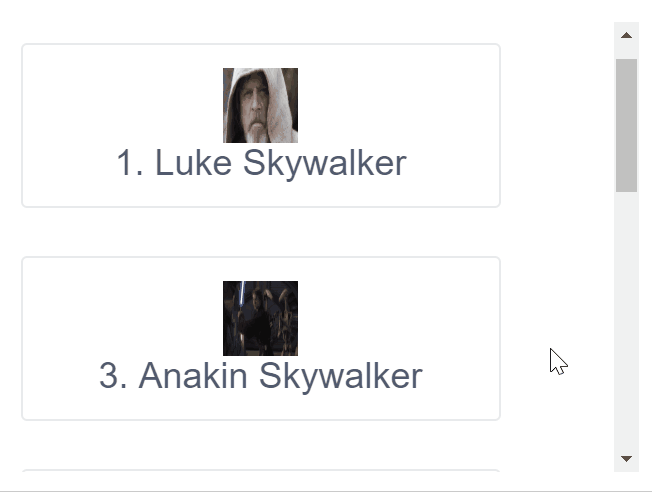

# iView - Scroll

> 一套基於 Vue.js 的高質量UI 組件庫，此篇介紹Scroll(無限卷軸顯示資料清單)

## Github

[iview/iview](https://github.com/iview/iview)


## 範例

### html

```html
<scroll :on-reach-bottom="handleReachBottom" 
        :on-reach-top="handleReachTop" 
        distance-to-edge=10
        loading-text="Loading"
        height="300">

        <!-- list data -->
        <card style="width:320px;margin:32px 0" v-for="(item, index) in listData" :key="item.id">
                <div style="text-align:center">
                    
                    <h3>{{item.id}}. {{ item.name }}</h3>
                </div>
        </card>

</scroll>
```

以上用到的Props：

| Prop | Description | Type | Default value |
|:------:|:----------|:----:|:-------------:|
| height | 捲動區域的高度pixel | String/Number | 300 |
| loading-text | 加載資料時顯示詞 | String | 加载中 |
| distance-to-edge | 從邊緣至觸發Callback的距離 | Number/Array | [20,20] |
| on-reach-bottom | 滾動至底部時觸發，須回傳Promise | Function |  |
| on-reach-top | 滾動至頂端時觸發，須回傳Promise | Function |  |

若要指定當滾動至底部或頂端時觸發事件，可利用Prop: `on-reach-edge`。


### JS

以下當滾動至底部或頂端時，再隨機取得三筆資料加入清單。

```javascript
const FOO_DATA_BASIC = [
    {id: 1, name:'Luke Skywalker',gender:'male', img:'https://goo.gl/KEUxHN'},
    //...
];

const FOO_DATA_BRIGHT = [
    {id: 1, name:'Luke Skywalker',gender:'male', img:'https://goo.gl/KEUxHN'},
    //...
];

const FOO_DATA_DARK = [
    {id: 9,name:'Darth Vader',gender:'male',img:'https://goo.gl/xcMHqj'},
    //...
];

var app = new Vue({
    el: "#app",
    data: {
        listData: []
    },
    methods: {
        handleReachBottom () {
            return new Promise(resolve => {
                setTimeout(() => {
                    for (let i = 0; i < 3; i++) { //Get random 3 records
                        let rndIndex = this.getRandomInt(0, FOO_DATA_BRIGHT.length-1)
                        this.listData.push(FOO_DATA_BRIGHT[rndIndex]);
                    }
                    resolve();
                }, 2000);
            });
        },
        handleReachTop(){
            return new Promise(resolve => {
                setTimeout(() => {
                    for (let i = 0; i < 3; i++) { //Get random 3 records
                        let rndIndex = this.getRandomInt(0, FOO_DATA_DARK.length-1)
                        this.listData.push(FOO_DATA_DARK[rndIndex]);
                    }
                    resolve();
                }, 2000);
            });
        },
        getRandomInt(min,max) {
            return Math.floor(Math.random()*(max-min+1)+min);
        }
    },
    created() {
        this.listData = FOO_DATA_BASIC;
    }
})
```

### Demo



更多應用可參考相關[API官方文件](https://www.iviewui.com/components/scroll#API)。


> 如果有興趣自己寫個Infinite Scroll，可參考小弟這篇文章：[[Vue] Infinite scrolling page](http://karatejb.blogspot.com/2018/02/vue-infinite-scrolling-page.html)


