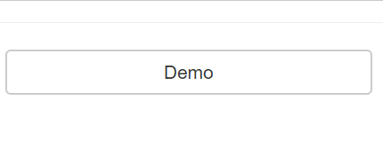

# vue-loading-overlay

> 載入中(Loading)遮罩套件，可以全螢幕或在指定的Element中顯示

## Github

[ankurk91/vue-loading-overlay](https://github.com/ankurk91/vue-loading-overlay)


## 使用方式

使用方式有兩種：
1. Component
2. Plugin

### Use as Component


```html
<loading loader="bars" 
        :active.sync="isLoading" 
        :can-cancel="true" 
        :is-full-page="false"></loading>
```

```javascript
import VueLoading from 'vue-loading-overlay'
import 'vue-loading-overlay/dist/vue-loading.css'

new Vue({
    el: "#app",
     components: {
        loading: VueLoading
    },
    data: {
      isLoading: true,
    },
    mounted(){
         setTimeout(() => {
            this.isLoading = false
        },3000)
    }
});
```


### Use as Plugin

先註冊Plugin，

```javascript
import VueLoading from 'vue-loading-overlay'
import 'vue-loading-overlay/dist/vue-loading.css'

//vue-loading-overlay
Vue.use(VueLoading); //Use default options
```

可同時做全域設定：

```javascript
Vue.use(VueLoading, {
    canCancel: false,
    color: '#000000',
    loader: 'dots', //spinner/dots/bars
    width: 50,
    height: 50,
    backgroundColor: '#ffffff',
    isFullPage: true,
    opacity: 0.8
}); 
```

使用API顯示方式：

```javascript
Vue.$loading.show({ options }, { slots } )
```

第二個參數在後面會介紹，我們先帶入第一個參數來顯示載入中動畫，

```javascript
//With global settings
let loader = this.$loading.show(); 

//Use optional local settings
let loader = this.$loading.show({
        canCancel: true, // default false
        onCancel: this.yourMethodName,
        color: '#000000',
        loader: 'spinner',
        width: 64,
        height: 64,
        backgroundColor: '#ffffff',
        opacity: 0.5,
    });

setTimeout(() => {
    loader.hide()
},3000)
```

### Demo


## 範例

### Non-full-page

預設Prop:`isFullPage`為`true`，若要僅針對某個Container element顯示vue-loading-overlay，需設定：

1. `isFullPage=false`
2. 設定該Element CSS: `position: relative`


#### For Component way

```html
<div style="position:relative">
    <loading loader="bars" 
        :active.sync="isLoading" 
        :is-full-page="false"></loading>
    <select class="form-control" @change="showLoading">
        <option vlaue="1">Book</option>
        <option vlaue="2">Toy</option>
    </select>
</div>
```

```javascript
showLoading(){
    this.isLoading = true;
    setTimeout(() => {
        this.isLoading = false
    },3000)
}
```


#### For Plugin way (API)

使用API前除了上述兩個條件，需額外在Container element加入ref，以指定對應的DOM。

```html
<div class="col-md-3" ref="demo">
        <button style="width:100%" class="btn btn-default" @click="showLoading">Demo</button>
</div>
```

```javascript
showLoading(){
    let loader = this.$loading.show({
    container: this.$refs.demo,
    });
    setTimeout(() => {
        loader.hide();
    },3000)
}
```




### 自訂圖示及文字

支援Slots以顯示自訂圖示及文字：

| Slots name | Description |
|:----------:|:------------|
| default |  主要的動畫圖示  |
| before |  前置文字  |
| after |  後置文字  |


#### For Component way

於vue-loading-overlay直接指定並設計Slots:

```html
 <loading :active.sync="isLoading" :is-full-page="true">
        <template slot="before">I am</template>
        <template slot="default">
          <font-awesome-icon :icon="['fas', 'crosshairs']" size="lg" spin />
        </template>
        <template slot="after">loading</template>
</loading>
```


#### For Plugin way (API)

這邊我們要利用第二個API參數來帶入我們自行建立的Loading component:

```javascript
Vue.$loading.show({ options }, { slots } )
```


範例程式碼：

```javascript
Vue.component('my-loading', {
    template: `
      <h2>
       <font-awesome-icon :icon="['fas', 'crosshairs']" size="lg" spin />
       Loading...
     </h2>`
});

new Vue({
    el: '#app',
    components:{
        MyLoading
    },
    mounted: function () {
        let loader = this.$loading.show({
           //options
        },{
            default: this.$createElement('MyLoading'),
            //before: this.$createElement('xxxx'),
            //after: this.$createElement('xxxx')            
        });

        setTimeout(() => {
            loader.hide();
        },3000)
    }
})
```


