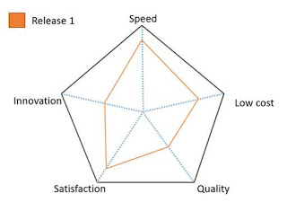
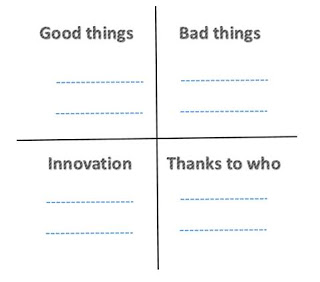

# Introduction

**Kaizen (Continue Improvement)** is `action plan`, `philosophy` and `culture`.

1. Process improvement
2. People improvement
3. Product improvement

# Process Improvement

## Iteration retrospective meeting

Hosted: `Scrum master`
Attendees: `Scrum master` and `Team`, others may attend but just watch.

### Helped

> What worked well in this iteration?

### Hindered(阻礙)

> What didn’t work well in this iteration?

### Hypothesis(假設)

> What action can we take in next iteration.

## Five Stage Retrospective

### Setting the stage

Good, safe environment

### Gather data

1. Timelines

   Collect facts and feelings in a timeline.

2. Color code dots

   Stick red spot(good) and blue spot(bad) in Timeline’s fact.

3. Mad/Sad/Glad

   Similar to 2., but use mad, sad, glad stickers.

4. Triple nickels

   Each member write 5 facts(questions or problems) in 5 minutes, pass it to the right one, and he/she write the improvement actions or comments in in 5 minutes.

5. Locate strength

   Interview each other.

6. Team Radar

   

7. Learning Matrix

   

### Generate insights

1. Brain storming

2. Five whys

3. Fishbone

4. Identify theme

### Decide what to do

1.  Select 2 or 3 actions for next iteration from action plans.

2.  Only take actions the team is able to do

### Closing the retrospective

1. ROTI (Return on Time invested)

2. Plus/Delta evaluation

## Intraspective meeting

1. Informal meeting hold by Scrum mater
2. To discuss the issues from daily scrum and find out solutions

## Tailoring(裁縫，量身訂做) Process

Tailoring the process due to the difference of project scope, tech challenge and etc.

| 

 |  
Spirit
  | 
Description
  |
|:------------------|:--------------------------|:-----------------------|
| Shu 守            | Protect, obey   | Learning and following fundamentals |
| Ha 破             | Digress(脫離)   | Breaking the rules |
| Ri 離             | Leave, Separate | * Transcendence(超越) * No trick wins trick(無招勝有招) * Using no way as way, having no limitation as limitation.(以無法為有法，以無限為有限 – 李小龍) |

  
# People Improvement

### Knowledge sharing

### Self-assessment (自我評估)

### Agile KPI

1. Actual stories completed vs. Committed stories
2. Tech debt management
3. Team velocity
4. Quality delivered to customers
5. Team enthusiasm (團隊熱情)
6. Retrospective process improvement
7. Communication
8. Team’s adherence(附著) to Scrum framework and engineering practices
9. Understanding of iteration scope and goal

  
# Product Improvement

### Daily standup meeting

### Iteration review meeting