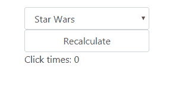

# vue-async-computed

> 可支援非同步computed property的套件，支援Vue.js 2.0以上的版本

## Github

[foxbenjaminfox/vue-async-computed](https://github.com/foxbenjaminfox/vue-async-computed)


## 範例

建立一個下拉式選單，而其可選擇的值為查詢Http api而來。
利用[vue-async-computed](https://github.com/foxbenjaminfox/vue-async-computed)，我們在`asyncComputed`定義一組非同步的computed property: `options`，並建立：

1. `get` method: 在此方法執行非同步查詢
2. `default` method/property: 在未回傳非同步查詢結果時，以此方法的回傳常數值代替之


### JS
```
Vue.use(AsyncComputed);

var app = new Vue({
    el: "#app",
    asyncComputed: {
        movies: {
            get() {
                var vm = this;
                let options = [];
                return axios.get('http://localhost:1234/Movies')
                    .then(function (response) {
                        if (response.data) {
                            response.data.forEach(function (item) {
                                options.push({
                                    text: item.name,
                                    value: item.id
                                });
                            });
                        }
                        return options;
                    });
            },
            // default: [{
            //     text: 'Loading...',
            //     value: '0'
            // }]
            default () {
                return [{ text: 'Loading...', value: '0'}];
            }
        }
    }
})
```

> 如果要定義一個Global default value，可寫在`Vue.use`：
>
> ```
> Vue.use(AsyncComputed, {
>   default: [{ text: 'Loading...', value: '0'}]
> })
> ```


### HTML
```
<select class="form-control">
    <option v-for="item in movies" :value="item.value">
        {{ item.text }}
    </option>
</select>
```

### Demo


### 監測異動即重新計算(Watch for Recalculation)

若需要監測(watch)來觸發重新執行非同步計算(查詢)，可使用`watch`來偵測裡面任一變數的異動，後重新執行`get` method。
例如我們在UI上加上一個按鈕來累加`clickTimes`的值。

`<input type="button"  @click="recalculate()" value="Recalculate">`

```
var app = new Vue({
    el: "#app",
    data:{
        clickTimes: 0
    },
    asyncComputed: {
        movies: {
            get() {
              // Skip...   
            },
            watch(){
                this.clickTimes,
                //...
            }
        }
    },
    methods:{
        recalculate(){
            var vm = this;
            vm.clickTimes++;
        }
    }
})
```


#### Demo


### 符合條件即重新計算(Conditional Recalculation)

在`shouldUpdate`加上判斷邏輯並回傳boolean以在符合特定條件下再重新進行非同步計算(查詢)。
例如以下是每點選兩次按鈕再重新取值。

```
var app = new Vue({
    el: "#app",
    data:{
        clickTimes: 0,
    },
    asyncComputed: {
        movies: {
            get() {
               //Skip...
            },
            shouldUpdate(){
                return this.clickTimes%2==0; 
            }
        }
    },
    methods:{
        recalculate(){
            var vm = this;
            vm.clickTimes++;
        }
    }
})
```


#### Demo




