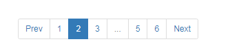

# vuejs-paginate

> 製作分頁的套件，支援Vue.js 2.0以上的版本


## Github

[lokyoung/vuejs-paginate](https://github.com/lokyoung/vuejs-paginate)


## 範例

底下是在[vuejs-paginate](https://github.com/lokyoung/vuejs-paginate)套上bootstrap3的`pagination`樣式後的結果。




使用上相當簡單，先註冊(register)`paginate`即可使用在頁面上，比較需要額外處理的是**資料的分頁**。
先看一下標準使用範例...

### JS

```javascript
Vue.component('paginate', VuejsPaginate)
```

### HTML

```html
<paginate :page-count="pageCount" 
            :page-range=1
            :init-page=0 
            :margin-pages=2 
            :click-handler="pageCallback">
</paginate>
```

以下列出較常用的參數，詳細參數表可參考[作者的Github](https://github.com/lokyoung/vuejs-paginate)。

| 參數 | 類型 | 說明 |
|:-----|:---:|:-----|
| page-count | Number | 分頁總數 |
| page-range | Number | 顯示的分頁數(頭) |
| margin-pages | Number | 顯示的分頁數(尾巴) |
| prev-text | String | "上一頁按鈕"上要顯示的文字，可以是HTML |
| next-text | String | "下一頁按鈕"上要顯示的文字，可以是HTML |
| initial-page | Number | 預設顯示第幾個分頁 |
| click-handler | Function | 當改變分頁(點擊分頁號碼或上、下按鈕時)的回呼函式 |


上面的範例只是單純顯示分頁的按鈕，實際呈現資料仍要透過我們實際去寫程式碼。
以下是ㄧ個較完整的範例；


### HTML

```html
<div>
    <paginate :page-count="pageCount" 
                :page-range=1
                :init-page=0 
                :margin-pages=2 
                :page-class="'page-item'" 
                :page-link-class="'page-link-item'"
                :container-class="'pagination pagination-sm'" 
                :prev-class="'prev-item'" 
                :prev-link-class="'prev-link-item'" 
                :next-class="'next-item'"
                :next-link-class="'next-link-item'" 
                :click-handler="pageCallback">
    </paginate>
</div>
<div>
    <table class="table">
        <thead class="thead-dark">
            <tr>
                <th>Name</th>
                <th>Gender</th>
                <th>Img</th>
            </tr>
        </thead>
        <tbody>
            <tr v-for="ppl in pagedListdata">
                <td>{{ ppl.name }}</td>
                <td>{{ ppl.gender }}</td>
                <td></td>
            </tr>
        </tbody>
    </table>
</div>
```

### JS

```javascript
Vue.component('paginate', VuejsPaginate)

const PAGE_SIZE = 2; //Show how many records in a single page
const FOO_DATA = [
    {name:'Luke Skywalker',gender:'male', img:''},...];

var app = new Vue({
    el: "#app",
    data:{
        listdata: [],
        currentPage: 1,
        pageCount: 1
    },
    computed: {
        pagedListdata: function () {
            var vm = this;
            if (vm.listdata && vm.listdata.length > 0) {
                return vm.listdata.filter(function (x) {
                    return x.page === vm.currentPage;
                })
            }
            else {
                return [];
            }
        }
    },
    watch: {
        listdata: function (val) {
            this._setPage2Model();
        }
    },
    methods:{

        _setPage2Model: function () {
            var vm = this;

            if (!vm.listdata || vm.listdata.length <= 0) {
                vm.pageCount = 1;
            }
            else {
                vm.pageCount = parseInt(vm.listdata.length / PAGE_SIZE) + (vm.listdata.length % PAGE_SIZE > 0 ? 1 : 0);
                for (let i = 0; i < vm.listdata.length; i++) {
                    vm.$set(vm.listdata[i], "page", parseInt(i / PAGE_SIZE) + 1);
                }
            }
        },

        pageCallback: function (page) {
            var vm = this;
            this.$set(vm, 'currentPage', page);
        }
    },
    created() {
        var vm =this;
        vm.listdata = FOO_DATA;
    }
})
```

### Demo


