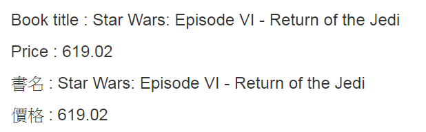
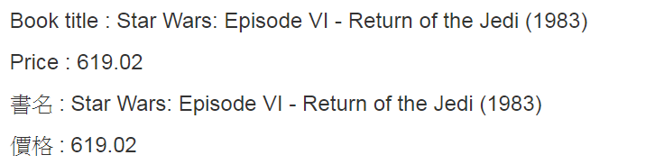
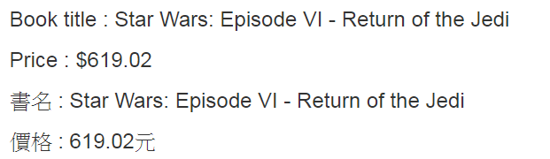

# vue-i18n (2)

> 多國語系套件


## Github

[kazupon/vue-i18n](https://github.com/kazupon/vue-i18n)


延續上一篇，我們來看如何使用[vue-i18n](https://github.com/kazupon/vue-i18n)的[Formating](http://kazupon.github.io/vue-i18n/guide/formatting.html#html-formatting)和[Custom directive localization](http://kazupon.github.io/vue-i18n/guide/directive.html#object-syntax)。


## Formatting


### HTML formatting

```
const messages = {
  'en-US': {
    "column": {
      "name": "<p style='color:red'>Book title<p>",
      "price": "<p style='color:blue'>Price<p>",
    }
  },
  'zh-TW': {
    "column": {
      "name": "<p style='color:red'>書名</p>",
      "price": "<p style='color:blue'>價格</p>",
    }
  }
}
```

```
<h3 v-html="$t('column.name')"></h3>
<h3 v-html="$t('column.price')"></h3>
```

結果：


### Named formatting

```
const messages = {
  'en-US': {
    "column": {
      "name": "Book title : {book}",
      "price": "Price : {price}",
    }
  },
  'zh-TW': {
    "column": {
      "name": "書名 : {book}",
      "price": "價格 : {price}",
    }
  }
}
```

另外我們額外定義一組data在vue instance，

```
data:{
starwars: { 
    book: 'Star Wars: Episode VI - Return of the Jedi',
    year: 1983,
    price: 619.02
}
}
```

使用方式：
```
<h3>{{ $t('column.name', 'en-US', {book: starwars.book}) }}</h3>
<h3>{{ $t('column.price','en-US', {price: starwars.price}) }}</h3>
<h3>{{ $t('column.name', 'zh-TW', {book: starwars.book}) }}</h3>
<h3>{{ $t('column.price','zh-TW', {price: starwars.price}) }}</h3>
```

結果：



### List formatting

```
const messages = {
  'en-US': {
    "column": {
      "name": "Book title : {0} ({1})",
      "price": "Price : {0}",
    }
  },
  'zh-TW': {
    "column": {
      "name": "書名 : {0} ({1})",
      "price": "價格 : {0}",
    }
  }
}
```

延用上個例子的data，我們可使用兩種方式繫結參數值

```
$t('column.price', {'0': starwars.price})
```

或用Array指定參數值：
```
$t('column.name', [starwars.book, starwars.year])
```

例如以下HTML
```
<h3>{{ $t('column.name', 'en-US', [starwars.book, starwars.year]) }}</h3>
<h3>{{ $t('column.price','en-US', {'0': starwars.price}) }}</h3>
<h3>{{ $t('column.name', 'zh-TW', [starwars.book, starwars.year]) }}</h3>
<h3>{{ $t('column.price','zh-TW', {'0': starwars.price}) }}</h3> 
```

顯示結果：



以上程式碼可參考這邊的[Source code]()


## Custom directive localization

在HTML裡可將
```
<p>{{ $t("column.name") }}</p>
```
改為使用custom directive:`v-t`的方式：
```
<p v-t="'column.name'"></p>
```


以下是使用`v-t`加上Named formatting的範例。

[Source code]()

```
const messages = {
  'en-US': {
    "column": {
      "name": "Book title : {book}",
      "price": "Price : ${price}",
    }
  },
  'zh-TW': {
    "column": {
      "name": "書名 : {book}",
      "price": "價格 : {price}元",
    }
  }
}
```

```
<h3 v-t="{ path: 'column.name', locale: 'en-US', args: { book: starwars.book } }"></h3>
<h3 v-t="{ path: 'column.price', locale: 'en-US', args: { price: starwars.price } }"></h3>
<h3 v-t="{ path: 'column.name', locale: 'zh-TW', args: { book: starwars.book } }"></h3>
<h3 v-t="{ path: 'column.price', locale: 'zh-TW', args: { price: starwars.price } }"></h3>
```

結果：



> `$t`在重新渲染(re-render)時會重新做翻譯(translate)，但是`v-t`會針對已經翻譯的部分做快取，因此`v-t`有較好的效能，但在使用上則是`$t`有較大彈性。 詳細比較可參考：[$t vs v-t](http://kazupon.github.io/vue-i18n/guide/directive.html#t-vs-v-t)


