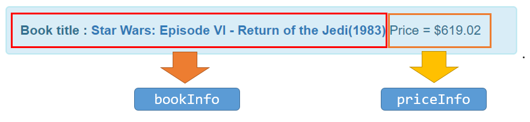

# vue-i18n (4) - Component interpolation

> 多國語系套件

## Github

[kazupon/vue-i18n](https://github.com/kazupon/vue-i18n)


假設我們要串接多個vue-i18n的語系字典，例如：


最直覺的寫法如下：
```
<strong>{{ $t('column.name') }} : <a :href="starwars.url"">{{ starwars.book }}({{ starwars.year
        }})</a></strong>
{{ $t('column.price') }} = {{ $n(starwars.price, 'currency') }}
```

看起來有些笨重(cumbersome)；
這一篇將說明如何使用[Component interpolation](http://kazupon.github.io/vue-i18n/guide/interpolation.html)(元件插值)來組成多個語系字典的串接。
其好處是簡化寫法或避免使用`v-html`可能造成的XSS風險。


## 範例

在把寫法轉成Component interpolation前，我們得先思考如何"切句子"。
以我們這個範例來說還算單純，可切成：
- 書籍資訊
- 價格資訊

如下圖：



以HTML來看：


接下來我們要實際在多國語系字典加入這兩個資訊的Named formatting：
- bookInfo
- priceInfo

### JS

```
const messages = {
  'en-US': {
    "name": "Book title",
    "price": "Price",
    "bookInfo": "{title} : {link}",
    "priceInfo": "{title} = {howmuch}"
  },
  'zh-TW': {
    "name": "書名",
    "price": "價格",
    "bookInfo": "{title} : {link}",
    "priceInfo": "{title} = {howmuch}"
  }
}
```

### HTML

我們先來看如何使用Component interpolation來組成**價格資訊**

```
<i18n path="priceInfo" tag="any" :places="{title: $t('price'), howmuch: $n(starwars.price, 'currency')}">
</i18n>
```

| Prop | Description |
|:-----|:------------|
| path | 表示要使用哪個語系字典 |
| tag | 要產生的HTML tag |
| places | 帶給Named formatting的值 |

所以上面的`i18n` Component將產生以下HTML (以en-US為例)：

`<any>Price = $619.02</any>`


下一步來組成**書籍資訊**；
由於書籍資訊中包含了一般文字和超連結文字(`<a>`)，而最外層是`<strong>`tag，
所以在`component`中的`tag`指定為`strong`，
並在`component`裡面額外定義上述的HTML tag：

```
<i18n path="bookInfo" tag="strong">
    <any place="title">{{ $t('name') }}</any>
    <a place="link" :href="starwars.url">{{ starwars.book }}({{ starwars.year }})</a>
</i18n>
```

這裡額外使用的Props如下：

| Prop | Description |
|:-----|:------------|
| place | 指定目前所在的HTML將取代哪個Named formatting的值，例如`<any place="title">{{ $t('name') }}</any>`目標是取代`bootkInfo`這個字典裡面的`title` |


改寫後的結果不變，如下圖...


完整範例程式碼，可參考這邊的[Source code](https://github.com/KarateJB/eBooks/tree/master/Vue.js/07.%20vue-i18n%20(4)/sample%20code)

