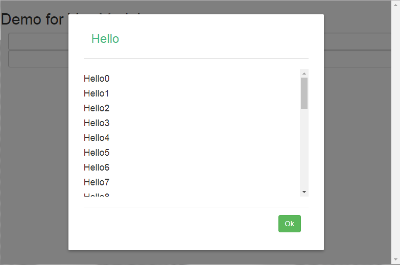

# vue-pop-modal

> 小弟自己寫的簡單pop-up modal，支援兩種顯示方式：
> - 依據內容決定的非固定長度
> - 當內容超過時顯示卷軸的固定長度

## Github

[KarateJB/Vue.Modal](https://github.com/KarateJB/Vue.Modal)


## Props

| Prop | 描述 | 型態 | 是否必要 | 預設值  |
|------------|--------------------------------------------------------|---------|------|----------|
|  isFix     | "true":固定長度，"false":非固定長度 | String  |      | "false"  |
|  disableOk | 是否取消顯示OK按鈕                  | Boolean |      |  false   |


## Events

| 事件 | 描述 |
|:-----|:------------|
| close | 當使用者點選OK按鈕時將觸發的事件，通常用於儲存使用者輸入於Modal中的內容 |
| cancel | 當使用者點選非作用區域(遮罩區域)將觸發的事件，通常用於直接關閉該Modal  |


## 範例

### Non-fixed height 非固定長度


```
<pop-modal v-if="showModal" v-on:close="closeModal" v-on:cancel="showModal=false">
    <p slot="header">
        {{ myHeader }}
    </p>
    <div slot="body">
        {{ myContent }
    </div>
    <p slot="header">
        {{ myFooter }}
    </p>
</pop-modal>
```

[Demo](http://karatejb.github.io/demo/vue-pop-modal/demo1.html) 


### Fixed height 固定長度



```
<pop-modal v-if="showModal" is-fix="true" v-on:close="closeModal" v-on:cancel="showModal=false">
    <p slot="header">
        {{ myHeader }}
    </p>
    <div slot="body">
        {{ myContent }
    </div>
    <p slot="header">
        {{ myFooter }}
    </p>
</pop-modal>
```

[Demo](http://karatejb.github.io/demo/vue-pop-modal/demo2.html)
