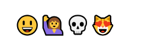

# vue-markdown

> 將Mardown語法轉成HTML的套件。

## Github

[miaolz123/vue-markdown](https://github.com/miaolz123/vue-markdown)


## 範例


使用上相當簡單，只需加入`Vue.use(VueMarkdown)`，在HTML裡將Markdown的文字以`<vue-markdown></vue-markdown>`包起來即可。

### JS

```javascript
Vue.use(VueMarkdown);

var app = new Vue({
    el: "#app"
})
```

### HTML 

```html
<vue-markdown>## Demo</vue-markdown>
<vue-markdown>[A link to Google](https://googl.com)</vue-markdown>
```
或
```
<vue-markdown>
## Demo
[A link to Google](https://googl.com)
</vue-markdown>
```

結果如下圖：


也支援各種[Props](https://github.com/miaolz123/vue-markdown#props)；


### linkify

| Prop | Description | Type | Default value |
|:----:|:------------|:----:|:-------------:|
| linkify | 是否啟用自動將網址文字轉為超連結 | Boolean | true |

例如以下關閉`linkify`後，將顯示純文字而非超連結。

```html
<vue-markdown :linkify="false">www.google.com</vue-markdown> 
```


### `source` and `anchor-attributes`

| Prop | Description | Type | Default value |
|:----:|:------------|:----:|:-------------:|
| source | 綁定程式碼資料以顯示 | String | null |
| anchor-attributes | 指定Html tags內的屬性及其值 | Object | {} |


```html
<vue-markdown :source="now"></vue-markdown>
<vue-markdown :anchor-attributes="linkAttrs">[A link to Google](https://google.com)</vue-markdown>
```

```javascript
Vue.use(VueMarkdown);

var app = new Vue({
    el: "#app",
    data:{
        now: new Date().toLocaleTimeString(),
        linkAttrs: {
            target: '_blank',
            id: 'mylink'
          } 
    },
    created() {
        var vm =this;
    },
})
```

產生的HTML如下：

```html
<div><p>下午11:39:21</p></div>
<div><p><a href="https://google.com" target="_blank" id="mylink">A link to Google</a></p></div>
```

### emoji

| Prop | Description | Type | Default value |
|:----:|:------------|:----:|:-------------:|
| emoji | emoji轉換 | Boolean | true |


```html
<vue-markdown :emoji="true">:smiley::raising_hand::skull::heart_eyes_cat:</vue-markdown>
```



代碼表可參考[Complete list of github markdown emoji markup](https://gist.github.com/rxaviers/7360908)


### table-class

| Prop | Description | Type | Default value |
|:----:|:------------|:----:|:-------------:|
| table-class | 指定`<table>`的樣式名稱(Class name) | String | "table" |


指定table的樣式名稱，例如使用bootstrap；

```html
<vue-markdown table-class="table table-striped">
| Name | Lightsaber |
|:----:|:-------:|
| Anakin Skywalker | Blue |
| Darth Vader | Red |
| Mace Windu | Purple |
</vue-markdown>    
```

生成HTML：

```html
<table class="table table-striped">
    <!-- skip -->
</table>
```


