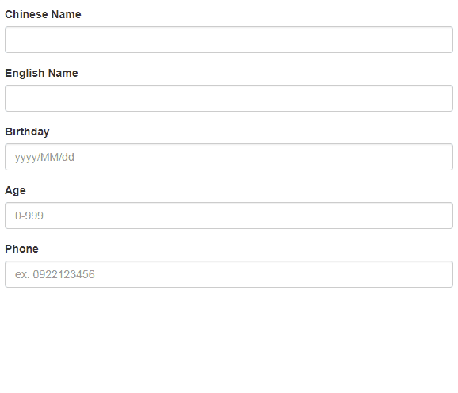

# v-mask

> 限制輸入框格式元件，例如當使用者輸入電話號碼"0911123456"，可主動讓其輸入值轉換為"0911-123-456"

## Github

[probil/v-mask](https://github.com/probil/v-mask)

## 格式限制指定值

| 符號 | 符合值域 |
|:----:|:--------|
| # | 數字 |
| A | 字母 (a-z, A-Z) |
| N | 數字或字母 |
| X | 任意 |
| ? | 表示下個限制符號非必要 |

## 範例

### JS

```
Vue.use(VueMask.VueMaskPlugin);

var app = new Vue({
    el: "#app",
    data:{
        me: {
            nameZh: null,
            nameEn: null,
            birthday: null,
            age: null,
            phone: null
        }
    }
})
```

### HTML

```
<input type="text" class="form-control" v-model="me.nameZh" v-mask="'X?X?X?X?X'">
<input type="text" class="form-control" v-model="me.nameEn" v-mask="'A?A?A?A?A?A?A?A?A'">
<input type="text" class="form-control" v-model="me.birthday" placeholder="yyyy/MM/dd" v-mask="'####/##/##'">
<input type="text" class="form-control" v-model="me.age" placeholder="0-999" v-mask="'#?#?#'">
<input type="text" class="form-control" v-model="me.phone" placeholder="ex. 0922123456" v-mask="'####-###-###'">
```


輸入後結果：


#### Demo

我在表單下方顯示實際按下的鍵盤Key，來對照看到`v-mask`作用在各輸入框的限制格式。




## 範例(動態指定格式)

以下範例是當僅輸入"中文姓名"時，將"生日"的欄位格式改為"民國年/月/日"，

### JS

```
Vue.use(VueMask.VueMaskPlugin);

var app = new Vue({
    el: "#app",
    data: {
        me: {
            nameZh: null,
            nameEn: null,
            birthday: null,
            age: null,
            phone: null
        },
        keys: ""
    },
    computed: {
        birthdayPlaceholder() {
            var vm = this;
            let text = "yyyy/MM/dd";
            if (vm.me.nameZh && !vm.me.nameEn) {
                text = "yy(民國年)/MM/dd";
            }
            return text;
        },
        birthdayFormat() {
            var vm = this;
            let format = "####/##/##";
            if (vm.me.nameZh && !vm.me.nameEn) {
                format = "##/##/##";
            }
            return format;
        }
    },
    methods: {
        keymonitor(event) {
            this.keys += event.key;
        }
    }
})
```


### HTML

```
<input type="text" class="form-control" id="birthday" v-model="me.birthday" 
       :placeholder="birthdayPlaceholder" 
       v-mask="birthdayFormat">
```

### Demo


請參考這裡完整的[Sample code](https://github.com/KarateJB/eBooks/tree/master/Vue.js/10.%20v-mask/sample%20code)。

