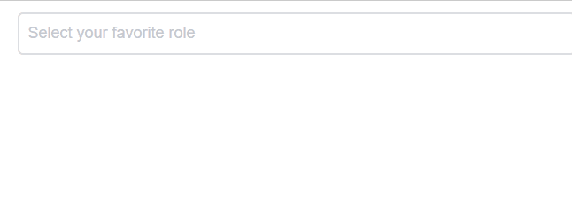

# iView - AutoComplete

> 一套基於 Vue.js 的高質量UI 組件庫，此篇介紹AutoComplete(自動完成)


## Github

[iview/iview](https://github.com/iview/iview)


## 範例

### HTML

```
<auto-complete v-model="keyword" 
              :data="matches" 
              @on-search="search" 
              placeholder="Select your favorite role">
</auto-complete>
```

### JS

```

const FOO_DATA = [
    'Luke Skywalker',
    'Leia Skywalker',
    //...
];

var app = new Vue({
    el: "#app",
    data: {
        starwars: [],
        keyword: "",
        matches: []
    },
    methods: {
        search(value){
            this.matches = this.starwars.filter(x=>x.startsWith(value));
        }
    },
    created() {
        this.starwars = FOO_DATA;
    }
})
```


## 使用自定義option slot

[Sample code](https://github.com/KarateJB/eBooks/tree/master/Vue.js/12.%20iview-AutoComplete/sample%20code)

### HTML

```
<auto-complete v-model="keyword" :data="matches" @on-search="search" placeholder="Select your favorite role">
    <div class="demo-auto-complete-item" v-for="item in matches">
        <div class="demo-auto-complete-group">
            <span>{{ item.name }}</span>
            
        </div>
        <Option>
            <span class="demo-auto-complete-title">{{ item.gender }}</span>
        </Option>
    </div>
</auto-complete>
```

### JS

```
const FOO_DATA = [{
        name: 'Luke Skywalker',
        gender: 'male',
        img: 'https://goo.gl/KEUxHN'
    },
    //...
];

var app = new Vue({
    el: "#app",
    data: {
        starwars: [],
        keyword: "",
        matches: []
    },
    methods: {
        search(value){
            this.matches = this.starwars.filter(x=>x.name.startsWith(value));
        }
    },
    created() {
        this.starwars = FOO_DATA;
    }
})
```




可再參考相關的API：[Props](https://www.iviewui.com/components/auto-complete#AutoComplete_props)及[Events](https://www.iviewui.com/components/auto-complete#AutoComplete_events)。
