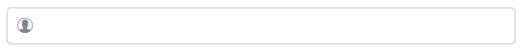
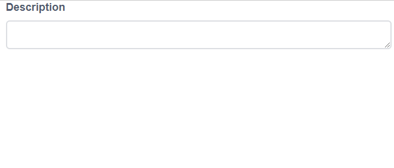
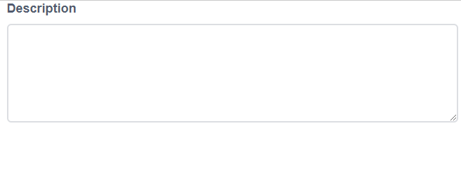
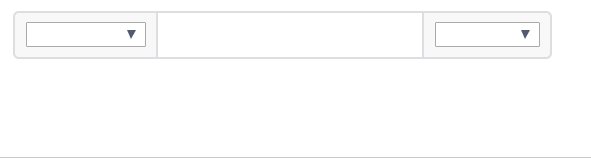

# iView - AutoComplete

> 一套基於 Vue.js 的高質量UI 組件庫，此篇介紹Input輸入框


## Github

[iview/iview](https://github.com/iview/iview)


## 範例

### 具有清空按鈕之輸入框

```html
<i-input v-model="myValue" clearable  />
```


### 自訂按鈕之輸入框

可使用`Prop`或`Slot`的前後顯示方式：

```html
<i-input v-model="me.name" prefix="ios-contact"  />
<i-input v-model="me.name" suffix="ios-contact"  />
```

```html
<i-input v-model="me.name">
    <icon type="ios-contact" slot="prefix" />
</i-input>
<i-input v-model="me.name">
    <icon type="ios-contact" slot="suffix" />
</i-input>
```




### 加入點選按鈕事件

```html
<!-- Birthday -->
<i-input v-model="me.birthday" 
        icon="ios-arrow-dropright-circle" 
        @on-click="giveAge(me.birthday)" />
<!-- Age -->
<i-input v-model="me.age" type="number" />
```

```javascript
var app = new Vue({
    el: "#app",
    data: {
        me: {
            name: "",
            birthday: "",
            age: null,
            gender: ""
        }
    },
    methods: {
        giveAge(birthday){
            if(birthday)
                this.me.age = this.calAge(birthday);
        },
        calAge(targetDate) {
            var today = new Date();
            var birthDate = new Date(targetDate);
            var age = today.getFullYear() - birthDate.getFullYear();
            var m = today.getMonth() - birthDate.getMonth();
            if (m < 0 || (m === 0 && today.getDate() < birthDate.getDate())) {
                age--;
            }
            return age;
        }
    }
})
```


### 加入搜尋按鈕

有以下三種方式來加入搜尋按鈕，並利用`@on-search`指定對應的搜尋方法。

#### 預設圖示 

```html
<i-input v-model="value" search @on-search="search()"/>
```


#### 按鈕

```html
<i-input v-model="value" search enter-button @on-search="search()" />
```


#### 按鈕並指定顯示文字

```html
<i-input v-model="value" search enter-button="Go" @on-search="search()" />
```


### TextArea

當設置`type='textarea'`即可成為多行輸入文字框，可使用
1. `rows`: 指定顯示行數
2. `autosize`: 自動依輸入行數變更長度，也可指定最小和最大顯示行數

#### 範例(1)

```html
<i-input type="textarea" v-model="me.description" :rows="4" />
```


#### 範例(2)

```html
<i-input type="textarea" v-model="me.description" :autosize="true"  />
```




#### 範例(3)

```html
<i-input type="textarea" v-model="me.description" :autosize="{minRows: 4,maxRows: 6}"  />
```




### 複合型輸入框

```javascript
<i-input v-model="myUrl">
    <Select v-model="myUrlPre" slot="prepend" style="width: 80px">
        <Option value="http">http://</Option>
        <Option value="https">https://</Option>
    </Select>
    <Select v-model="myUrlSuf" slot="append" style="width: 70px">
        <Option value="com">.com</Option>
        <Option value="org">.org</Option>
        <Option value="io">.io</Option>
    </Select>
</i-input>
```




可參考`i-input`更多的API：
* [Props](https://www.iviewui.com/components/input#Input_props)
* [Events](https://www.iviewui.com/components/input#Input_events)
* [Slots](https://www.iviewui.com/components/input#Input_slot)


[Sample code](https://github.com/KarateJB/eBooks/tree/master/Vue.js/13.%20iView-Input/sample%20code)
