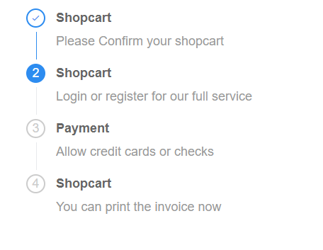
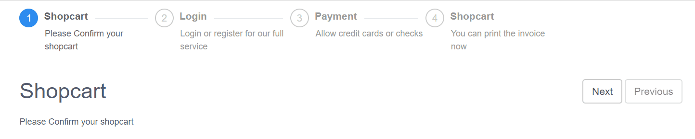

# iView - Steps

> 一套基於 Vue.js 的高質量UI 組件庫，此篇介紹步驟條(Steps)


## Github

[iview/iview](https://github.com/iview/iview)


## 範例

先定義幾個步驟：

```javascript
const STEPS = {
    shopcart: {
        title: "Shopcart",
        description: "Please Confirm your shopcart"    
    },
    login: {
        title: "Shopcart",
        description: "Login or register for our full service"    
    },
    payment: {
        title: "Payment",
        description: "Allow credit cards or checks"    
    },
    invoice: {
        title: "Shopcart",
        description: "You can print the invoice now"    
    }
}
```

```html
<steps :current="1">
    <step :title="steps.shopcart.title" :content="steps.shopcart.description"></step>
    <step :title="steps.login.title" :content="steps.login.description"></step>
    <step :title="steps.payment.title" :content="steps.payment.description"></step>
    <step :title="steps.invoice.title" :content="steps.invoice.description"></step>
</steps>
```

結果如下：


### 設定顯示方式

另可指定`size='small`來縮小步驟條，及 `direction='vertical'`(預設為`horizontal`)指定以垂直方式顯示。

```html
<steps :current="currentStep">
    <step :title="steps.shopcart.title" :content="steps.shopcart.description" ></step>
    <step :title="steps.login.title" :content="steps.login.description" ></step>
    <step :title="steps.payment.title" :content="steps.payment.description"></step>
    <step :title="steps.invoice.title" :content="steps.invoice.description"></step>
</steps>
```




### 指定顯示狀態

我們可透過設定`<step>`的Prop: `status`為`wait`、`process`、`finish`、`error`來顯示各種不同的帳態：

```html
<steps :current="currentStep">
    <step :title="steps.shopcart.title" :content="steps.shopcart.description" status='wait'></step>
    <step :title="steps.login.title" :content="steps.login.description" status='process'></step>
    <step :title="steps.payment.title" :content="steps.payment.description" status='finish'></step>
    <step :title="steps.invoice.title" :content="steps.invoice.description" status='error'></step>
</steps>
```

若要手動設定不同的icon可利用`<step>`的另一個Prop: `icon`。


### Demo

[Sample Code](https://github.com/KarateJB/eBooks/tree/master/Vue.js/14.%20iView-Steps/sample%20code)




> 請參考其API:[Steps Props](https://www.iviewui.com/components/steps#Steps_props)及[Step Props](https://www.iviewui.com/components/steps#Step_props)。


