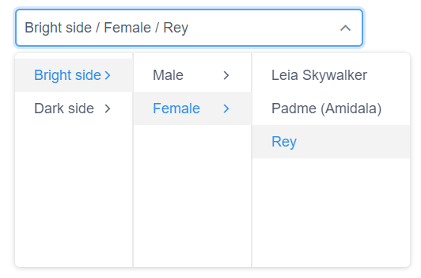
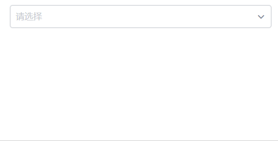

# iView - Cascader

> 一套基於 Vue.js 的高質量UI 組件庫，此篇介紹Cascader(級聯選擇器)


## Github

[iview/iview](https://github.com/iview/iview)


## 範例

### HTML

```html
<cascader :data="starwars" v-model="selected"></cascader>
```

### JS

以階層的方式定義資料：
* `value`: 選擇結果帶出的值
* `label`: 顯示的值
* `children`: 下一階層的資料
* `disabled: true`: 禁用該筆資料 (Optional)

例如底下以 **光明面/黑暗面**=>**男性/女性**=>**星際大戰腳色**作為Cascader的資料；

```
const FOO_DATA = [
    {
        value: 'Bright', label: 'Bright side',
        children: [
            {
                value: 'Male', label: 'Male',
                children: [
                    {value:1, label:'Luke Skywalker', img:'https://goo.gl/KEUxHN'},
                ]
            },
            {
                value: 'Female', label: 'Female',
                children: [
                    {value:2, label:'Leia Skywalker',img:'https://goo.gl/rNJhLU'},
                ]
            }
        ]
    },
    {
        value: 'Dark', label: 'Dark side',
        children: [
            {
                value: 'Male', label: 'Male',
                children: [
                    {value:9, label:'Darth Vader',img:'https://goo.gl/xcMHqj'},
                ]
            },
            {
                value: 'Female', label: 'Female',
                children: [
                    {value:13, label:'Asajj Ventress',img:'https://goo.gl/pr19sJ'}
                ]
            }
        ]
    }
    
];


var app = new Vue({
    el: "#app",
    data: {
        selected: [], 
        starwars:[]
    },
    methods: {
    },
    created() {
        this.starwars = FOO_DATA;
        this.selected = [ "Bright", "Male", 3 ];
    }
})
```

而`selected`的值為array，可直接帶入至`value`作為預設選擇值，例如`[ "Bright", "Male", 3 ]`。

輸出結果：




### Hover即帶出下一層並立即顯示已選擇該階層的值


透過設置
1. `trigger='hover'` : 以hover方式帶出下一層（預設為`click`）
2. `change-on-select` : 立即顯示已選擇該階層的值


```html
<cascader :data="starwars" v-model="selected" trigger='hover' change-on-select></cascader>
```


### 客製顯示格式

預設是 `XXX / YYY / ZZZ` 的格式來顯示已選擇值，可透過指定`render-format`來調整格式。
例如底下範例為當選擇至最後一層(腳色)時，將格式改為`姓名 (性別)`；


```html
<cascader :data="starwars" v-model="selected" :render-format="format" trigger='hover' change-on-select></cascader>
```

```javascript
var app = new Vue({
    el: "#app",
    data: {
        selected: [],
        starwars: [],
    },
    methods: {
        format(value, selectedData) {

            if (value.length === 3) {
                let gender = selectedData[1].label;
                let name = selectedData[2].label;

                return `${name} (${gender})`;
            }
            else
                return selectedData.map(o => o.label).join(' / ');
        }
    },
    created() {
        this.starwars = FOO_DATA;
    }
})
```




### 客製預設選擇器

例如我們用Button來取代Textbox，並同時利用綁定`on-change`事件將選擇的值顯示在此Button上：

```html
<cascader :data="starwars" v-model="selected" @on-change="handleChange" trigger='hover' change-on-select>
    <button class="btn btn-default" v-html="text"></button>
</cascader>
```

```javascript
var app = new Vue({
    el: "#app",
    data: {
        selected: [],
        starwars: [],
        text: "Please Select ..."
    },
    methods: {
        handleChange(value, selectedData) {
            var vm = this;
            if (value.length === 3) {
                let target = selectedData[2];
                let name = target.label;
                let img = target.img;

                vm.text = `&nbsp;${name}`;
            }
            else
                vm.text = selectedData.map(o => o.label).join(' / ');
        }
    },
    created() {
        this.starwars = FOO_DATA;
    }
})
```

結果如下：


[Sample code]()

相關API可參考[官方文件](https://www.iviewui.com/components/cascader#API)

