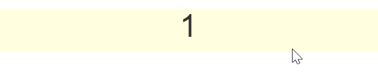

# Eagle.js

> Slide show套件 


## Github

[zulko/eagle.js](https://github.com/zulko/eagle.js/)


## 範例

使用方式包含兩部分：

1. mixins: `Slideshow`
2. component: `Slide`

我們將利用`SlideShow` mixins建立內含`Slide`的Component。


先全域註冊Eagle模組：

```javascript
import Eagle from 'eagle.js'
import 'eagle.js/dist/eagle.css'

Vue.use(Eagle);
```

下一步建立新的single file component，例如`Slider.vue`

```javascript
<template>
  <div>
    <slide steps="3">
        <div v-if="step==1">
            <h1>{{ step }}</h1>
        </div>
        <div v-if="step==2">
            <h1>{{ step }}</h1>
        </div>
        <div v-if="step==3">
            <h1>{{ step }}</h1>
        </div>
    </slide>
  </div>
</template>

<script>
import { Slideshow } from "eagle.js";

export default {
  name: "slider",
  mixins: [Slideshow],
  created() {
    this.firstslide = 1;
    this.lastslide = 3;
    this.startStep = 1;
    this.zoom = true;
    this.mouseNavigation = true;
    this.keyboardNavigation = true;
    this.repeat= true;
  }
};
</script>
```

上面程式碼使用了
1. `Slide`組件和指定其Prop: `steps`
2. 定義於`Slideshow` mixins的data: `step`，以及以下Props：

    | Prop | Description | Type | Default | 
    |:----:|:------------|:----:|:-------:|
    | startStep | 預設顯示第N張Slide，此為`step`的初始值 | Number | 1 |
    | firstslide | 第一張Slide從第幾個元素 | Number | 1 |
    | lastslide | 最後一張Slide為第幾個元素 | Number | null |
    | zoom | 支援縮放 | Boolean | true |
    | mouseNavigation | 支援滑鼠巡覽(點擊或滾輪) | Boolean | true |
    | keyboardNavigation | 支援鍵盤巡覽(左右鍵) | Boolean | true |


### 循環瀏覽

可利用`onStartExit`和`onEndExit`兩個事件來設定循環瀏覽。
在上一步建立的component加入以下程式碼：

```javascript
methods: {
    onStartExit() {
      this.step = this.lastslide;
    },
    onEndExit() {
      this.step = this.firstslide;
    }
},
```




### 加入換頁動畫

[Eagle.js](https://github.com/zulko/eagle.js/)採用了[animate.css](https://github.com/daneden/animate.css)的[各種動畫效果](https://github.com/daneden/animate.css#animations)。

先在頁面上引用CSS檔：

```html
<link rel="stylesheet" href="https://cdnjs.cloudflare.com/ajax/libs/animate.css/3.7.0/animate.min.css">
```

在Template中，在要使用動畫的前後加入`<eg-transition></eg-transition>`並設定`enter`和`leave`屬性：

```javascript
<div v-if="step==1">
    <eg-transition enter="fadeInRight" leave="fadeOutUpBig">
      <h1 class="title text-center">
        <b>2018年台北地區福委會 第四季慶生會</b>
      </h1>
    </eg-transition>
</div>
```


### Demo 

完整程式碼請參考[Source code](https://github.com/KarateJB/eBooks/tree/master/Vue.js/19.%20Eagle.js/sample%20code/app)


(背景圖片來源：[www.happy-birthday-to-you.net](https://www.happy-birthday-to-you.net/star-wars-happy-birthday-images-quotes/))


