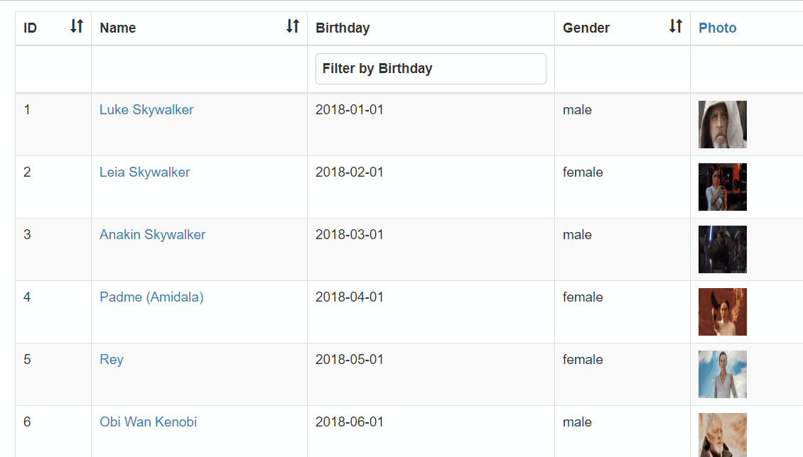

# vue-tables-2 (5)

> 表格套件，本篇主要介紹如何使用Filters

## Github

[matfish2/vue-tables-2](https://github.com/matfish2/vue-tables-2)


以下是Options中和Filter相關的設定選項:

| Option | Description | Type | Default value |
|:------:|:------------|:----:|:-------------:|
| filterByColumn | 是否開啟BY欄位做篩選的功能 | Boolean | false |
| filterable | 可供篩選的欄位清單，或設定`true`允許所有欄位，`false`表示不啟用Filter功能 | Array/Boolean | true |
| customFilters | 客製的Filter方法 | Array | [] |
| listColumns | 當開啟BY欄位做篩選，可設定此選項以使用Checkbox以選擇式篩選取代輸入式篩選 | Object | {} |

> Reference: [vue-tables-2/lib/config/defaults.js](https://github.com/matfish2/vue-tables-2/blob/master/lib/config/defaults.js)

## 範例

### 客製Filter

預設vue-tables-2已顯示一個Filter於表格上方，若要客製搜尋的方法，可利用Options:`customFilters`指定。

```html
<input type="text" ref="keyword" class="form-control" placeholder="Search by name or sith/jedi"/>
<input type="button" class="form-control" value="Search" @click="search($refs.keyword.value)">
<v-client-table ref="myTable" :data="tableData" :columns="columns" :options="options">   
</v-client-table>
```

在Search button點選事件中，呼叫vue-tables-2的Event bus: `vue-tables.filter::<Your filter name>`；

```javascript
new Vue({
    el: "#app",
    data: {
      columns: ["id", "name", "gender", "img"],
      tableData: [],
      options: {
        filterByColumn:false,
        filterable: false,
        customFilters: [{
            name: 'filterBySide',
            callback: function (row, query) {
                if(query.toLowerCase()==="sith")
                  return row.name.startsWith("Darth");
                else if(query.toLowerCase()==="jedi")
                  return row.name.endsWith("Skywalker");
                else
                  return row.name.toLowerCase().includes(query.toLowerCase());  
            }
        }],
      }
    },
    methods: {
        search(keyword){
             Event.$emit('vue-tables.filter::filterBySide', keyword);
        }
    }
});
```


### 開啟部分欄位的預設Filter

1. Options:`filterByColumn`需為`true`
2. Options:`filterable`設為`true`允許所有欄位開放篩選，或利用`['<欄位>',..]`指定開放的欄位

```javascript
new Vue({
    el: "#app",
    data: {
      columns: ["id", "name", "gender", "img"],
      tableData: [],
      options: {
        filterByColumn:true,
        filterable: ['name', 'gender']
      }
    }
});
```


### 客製欄位的Filter: List Filters

vue-tables-2提供了一個下拉式選單篩選功能，可取代預設的輸入篩選方式；
其方式為利用Options:`listColumns`設定對應哪個欄位及可選擇的值：

```javascript
new Vue({
    el: "#app",
    data: {
      columns: ["id", "name", "gender", "img"],
      tableData: [],
      options: {
        filterByColumn:true,
        filterable: ['gender'],
        listColumns: {
           gender: [ 
              { id: 'male', text: 'Male' }, 
              { id: 'female', text: 'Female' },
              { id: 'unknow', text: 'Unknown', hide: true }
           ]
        },
      }
    }
});
```

* `id`需與實際資料中的欄位值相同
* 若要隱藏該選項，則額外指定`hide: true`

![assets/demo2.gif]


### 客製欄位的Filter: 自行打造

我們也可以透過以下步驟設定欄位的Filter以我們客製的顯示範本和邏輯進行篩選：

1. 利用Slot name: `filter__<欄位>`設計範本，並綁定篩選事件
2. 在篩選事件中，呼叫Event bus裡我們客製在Options: `customFilters`裡面的Filter

底下將示範客製兩個欄位的Filter
- name : Textbox，但當按下Enter鍵後再做姓名篩選，並支援用"Sith"或"Jedi"兩個關鍵字做篩選
- gender : Radio button


#### HTML

```html
<v-client-table ref="myTable" :data="tableData" :columns="columns" :options="options">
  <template slot="filter__name">
    <input type="text" class="form-control" placeholder="Search by name or sith/jedi" 
            v-model="keywordName" @keyup="searchByName">
  </template>
  <template slot="filter__gender">
      <input type="radio" value="male" v-model="keywordGender" @change="searchByGender">
      <label for="one">Male</label>
      
      <input type="radio" value="female" v-model="keywordGender" @change="searchByGender">
      <label for="one">Female</label>
      </div>
  </template>
</v-client-table>
```

#### JS

```javascript
new Vue({
    el: "#app",
    data: {
     columns: ["id", "name", "gender", "img"],
      tableData: [],
      keywordName: null,
      keywordGender: null,
      options: {
        filterByColumn: true,
        filterable: [],
        customFilters: [
          {
            name: "filterBySide",
            callback: function(row, query) {
              if (query.toLowerCase() === "sith")
                return row.name.startsWith("Darth");
              else if (query.toLowerCase() === "jedi")
                return row.name.endsWith("Skywalker");
              else return row.name.toLowerCase().includes(query.toLowerCase());
            }
          },
          {
            name: "filterByGender",
            callback: function(row, query) {
                return row.gender === query;
            }
          }
        ]
      }
    },
methods: {
    searchByName(event) {
      if (event.keyCode === 13) {
        Event.$emit("vue-tables.filter::filterBySide", this.keywordName);
      }
    },
    searchByGender() {
      if(this.keywordGender){
        Event.$emit("vue-tables.filter::filterByGender", this.keywordGender);
      }
    }
  }
});
```


#### Demo




