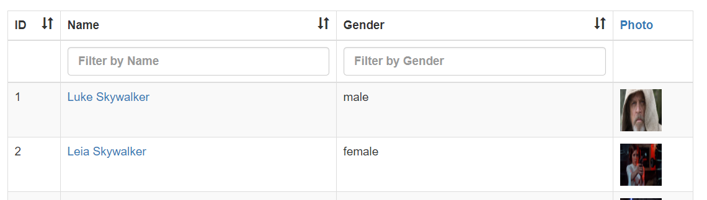

# vue-tables-2 (5)

> 表格套件，本篇主要介紹如何使用Filters

## Github

[matfish2/vue-tables-2](https://github.com/matfish2/vue-tables-2)


以下是Options中和Filter相關的設定選項:

| Option | Description | Type | Default value |
|:------:|:------------|:----:|:-------------:|
| filterByColumn | 是否開啟BY欄位做篩選的功能 | Boolean | false |
| filterable | 可供篩選的欄位清單，或設定`true`允許所有欄位，`false`表示不啟用Filter功能 | Array/Boolean | |
| customFilters | 客製的Filter方法 | Array | |
| | | | |

## 範例

### 客製Filter

預設vue-tables-2已顯示一個Filter於表格上方，若要客製搜尋的方法，可利用Options:`customFilters`指定。

```html
<input type="text" ref="keyword" class="form-control" placeholder="Search by name or sith/jedi"/>
<input type="button" class="form-control" value="Search" @click="search($refs.keyword.value)">
<v-client-table ref="myTable" :data="tableData" :columns="columns" :options="options">   
</v-client-table>
```

在Search button點選事件中，呼叫vue-tables-2的Event bus: `vue-tables.filter::<Your filter name>`；

```javascript
new Vue({
    el: "#app",
    data: {
      columns: ["id", "name", "gender", "img"],
      tableData: [],
      options: {
        filterByColumn:false,
        filterable: false,
        customFilters: [{
            name: 'filterBySide',
            callback: function (row, query) {
                if(query.toLowerCase()==="sith")
                  return row.name.startsWith("Darth");
                else if(query.toLowerCase()==="jedi")
                  return row.name.endsWith("Skywalker");
                else
                  return row.name.toLowerCase().includes(query.toLowerCase());  
            }
        }],
      }
    },
    methods: {
        search(keyword){
             Event.$emit('vue-tables.filter::filterBySide', keyword);
        }
    }
});
```


### 開啟部分欄位的Filter

```javascript
new Vue({
    el: "#app",
    data: {
      columns: ["id", "name", "gender", "img"],
      tableData: [],
      options: {
        filterByColumn:true,
        filterable: ['name', 'gender']
      }
    }
});
```




