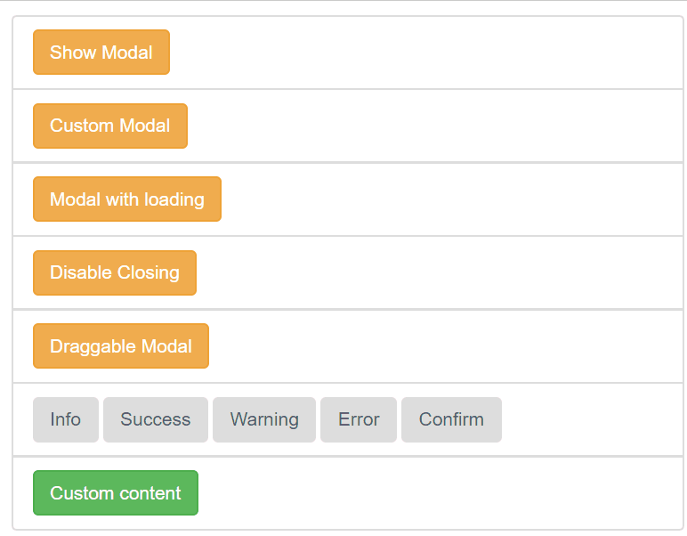

# iView - Modal

> 一套基於 Vue.js 的高質量UI 組件庫，此篇介紹Modal(對話框)

## Github

[iview/iview](https://github.com/iview/iview)


## 範例

### 標準對話框


```html
<button class="btn btn-warning" @click="isShowModal1 = true">Show Modal</button>
<modal v-model="isShowModal1" title="Standard" 
       @on-ok="ok" @on-cancel="cancel" 
       ok-text="Ok" cancel-text="Cancel">
    <p>Hello, this is iView Modal!</p>
</modal>
```

* 使用`v-model`綁定"是否顯示對話框"(Boolean value)
* 使用`on-ok`和`on-cancel`分別指定按下**確認**和**取消**的事件
* 使用`ok-text`和`cancel-text`分別指定**確認**和**取消**按鈕顯示的文字(預設是"确定"和"取消")

```javascript
new Vue({
    el: "#app",
    data: {
        isShowModal1: false,
    },
    methods: {
        ok() {
            console.info("Confirmed!");
        },
        cancel() {
            console.info("Cancelled!");
        }
    }
})
```


### 使用Slots客製對話框樣式


```html
<modal v-model="isShowModal2">
    <p slot="header" style="background-color:lightyellow;text-align:center">
        <icon type="ios-information-circle"></icon>
        <span>Custom Modal</span>
    </p>
    <div style="text-align:center">
        <h3>Hello, this is iView Modal!</h3>
    </div>
    <div slot="footer">
        <button class="btn btn-default" @click="isShowModal2=false">Close</button>
    </div>
</modal>
```

### 點選確認按鈕顯示載入動畫

適用於點選確認按鈕後座非同步傳輸的情景；


```html
<modal v-model="isShowModal3" loading title="Ok with loading" @on-ok="asyncOk" @on-cancel="cancel">
    <p>Hello, this is iView Modal!</p>
</modal>
```

```javascript
asyncOk() {
    setTimeout(() => {
        this.isShowModal3 = false;
    }, 2500);
},
```

### 取消 關閉按鈕 及 點選遮罩關閉



* `closable`： 是否啟用關閉按鈕
* `mask-closable` : 是否啟用點選遮罩關閉按鈕

```html
<modal v-model="isShowModal4" title="Disable Closing" :closable="false" :mask-closable="false">
    <p>Hello, this is iView Modal!</p>
</modal>
```


### 啟用拖曳功能


```html
 <modal v-model="isShowModal5" title="Draggable" draggable>
    <p>Hello, this is iView Modal!</p>
</modal>
```


### 以Model Instance方式開啟對話框

iView預設定義了以下幾組API來開啟對應的對話框

| Modal Type | API |
|:----------:|:----|
| 一般訊息 | `this.$Modal.info({ options...})` |
| 成功訊息 | this.$Modal.success({ options...})` |
| 警示訊息 | this.$Modal.warning({ options...}) |
| 錯誤訊息 | this.$Modal.error({ options...}) |
| 包含確認/取消按鈕的訊息 | this.$Modal.confirm({ options...}) |


```html
<button class="btn" @click="openModal('info')">Info</button>
<button class="btn" @click="openModal('success')">Success</button>
<button class="btn" @click="openModal('warning')">Warning</button>
<button class="btn" @click="openModal('error')">Error</button>
<button class="btn" @click="openModal('confirm')">Confirm</button>
```

```javascript
var app = new Vue({
    el: "#app",
    methods: {
        openModal(type) {
            let msg = "Hello, this is iView Modal!";
            switch (type) {
                case "info":
                    this.$Modal.info({
                        title: "Info",
                        content: msg
                    });
                    break;
                case "success":
                    this.$Modal.success({
                        title: "Success",
                        content: msg
                    });
                    break;
                case "warning":
                    this.$Modal.warning({
                        title: "Warning",
                        content: msg
                    });
                    break;
                case "error":
                    this.$Modal.error({
                        title: "Error",
                        content: msg
                    });
                    break;
                case "confirm":
                    this.$Modal.confirm({
                        title: 'Confirm',
                        content: msg,
                        onOk: () => { console.log("Confirmed")},
                        onCancel: () => { console.log("Cancelled")}
                    });
                    break;

            }
        }
    }
})
```

傳入的參數設定(Options)可參考[此表](https://www.iviewui.com/components/modal#Modal_instance)；
另可透過`this.$Modal.remove()`關閉對話框。


### 以Model Instance方式客製對話框

也可以透過在Modal Instance回傳Virtual DOM的方式客製對話框；


```html
<button class="btn btn-success" @click="customContent()">Custom content</button>
```

```javascript
var app = new Vue({
    el: "#app",
    data: {
        value: ""
    },
    methods: {
        customContent(){
            this.$Modal.confirm({
                render: (h) => {
                    return h('input', {
                        props: {
                            placeholder: 'Who is this?'
                        },
                        on: {
                            blur: (event) => {
                                this.value = event.target.value;
                            }
                        }
                    })
                },
                onOk: () => { alert(`Hello, ${this.value}`)}
            })
        }
    }
})
```

以上範例請參考[Sample code]()。
更多API請參考官方文件的
- [Props](https://www.iviewui.com/components/modal#Modal_props)
- [Events](https://www.iviewui.com/components/modal#Modal_events)
- [Slots](https://www.iviewui.com/components/modal#Modal_slot)
