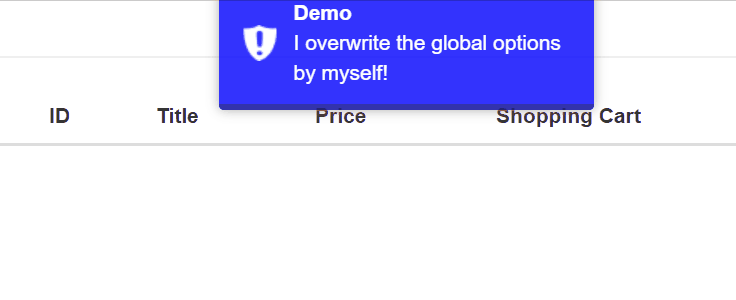

# vue-toastr

> 參考[toastr.js](https://github.com/CodeSeven/toastr) 的Vue.js提示/通知框(Toast notification)

## Github

[s4l1h/vue-toastr](https://github.com/s4l1h/vue-toastr)


## 使用方式

使用方式有兩種：
1. Component
2. Plugin

### Use as Component

#### 註冊

```javascript
import Toastr from 'vue-toastr';
import 'vue-toastr/dist/vue-toastr.css'
Vue.component('vue-toastr',Toastr);
```

#### HTML

```html
<vue-toastr ref="toastr"></vue-toastr>
```

#### JS

```javascript
this.$refs.toastr.i("XXXXXX");
```

### Use as Plugin

#### 註冊

```javascript
import Toastr from 'vue-toastr';
import 'vue-toastr/dist/vue-toastr.css'
Vue.use(Toastr);
```

#### 使用API

```javascript
//Information
this.$toastr.i("xxxxx");
//Error
this.$toastr.e("xxxxx");
//Success
this.$toastr.s("xxxxx");
//Warning
this.$toastr.w("xxxxx");
```

以下依據Plugin的使用方式做一些範例。

## 範例

### 設定全域預設選項

```javascript
const toastrConfig = {
    defaultTimeout: 2000,
	defaultProgressBar: true,
	defaultProgressBarValue: 0,
	defaultType: "info",
	defaultPosition: "toast-top-right",
	defaultCloseOnHover: false,
	defaultStyle: { "background-color": "red" }
};

Vue.use(Toastr, toastrConfig);
```


以下是vue-toastr提供的選項，若要使用在全域設定，則加上前綴詞`default`。

#### Options

| Prop | Description | Type | Default |
|:----:|:------------|:----:|:-------:|
| name | 指定該toastr名稱 | String | |
| title | Title | String | |
| msg | 訊息內容 | String | |
| position | 顯示位置，其值可為 <br />`toast-top-right`,`toast-top-left`,`toast-top-full-width`, `toast-top-center`,<br />`toast-bottom-right`, `toast-bottom-left`,  `toast-bottom-full-width`, `toast-bottom-center` | String | `toast-top-right` |
| type | info,warning,error,success | String | `success` |
| timeout | 自動N毫秒後關閉 | Number | 5000 |
| progressbar | 開啟此選項會於訊息下方加上進度條，需同時至少設定timeout或progressBarValue其一 | Boolean | true |
| progressBarValue | 0 - 100 | Number | null |
| preventDuplicates | 是否啟用避免重複顯示 | Boolean | false | 
| style | 樣式(Styles) | Object | {} |
| closeOnHover | 當設定為`false`時，hover行為將停止timeout引發關閉 | Boolean | true |
| clickClose | 點擊訊息導致關閉 | Boolean | false |
| onCreated | Toastr created event | Function | |
| onClicked | Click event | Function | |
| onClosed  | Toastr closed event | Function | |
| onMouseOver | Mouse over event | Function | |
| onMouseOut | Mouse out event | Function | |


### 顯示時額外設定選項

- 若在此無另外設定，以全域預設選項為主
- 當設定`name`屬性時，可利用後面提到的API由程式控制關閉

```javascript
this.$toastr.Add({
        name: "myInfo",
        title: "Demo",
        msg: "I overwrite the global options by myself!",
        clickClose: false, //Disable click to close 
        timeout: 3000, // 3 sec
        position: "toast-top-full-width",
        type: "error", //error, warning, success, info
        preventDuplicates: true, 
        style: { backgroundColor: 'blue',width:'250px' }
    });
```




### 關閉

指定名稱關閉：

```javascript
this.$toastr.removeByName("myInfo");
```

指定類型關閉：

```javascript
this.$refs.toastr.removeByType("error"); // error, warning, success, info
```


### 保留訊息

我們可以透過設定選項：`closeOnHover=false`
以讓使用者Hover到Toastr訊息時能保留訊息在畫面上不關閉。
(移開時，timeout會重新倒數)

```javascript
this.$toastr.Add({
        closeOnHover: false,
        timeout: 2000
    });
```


