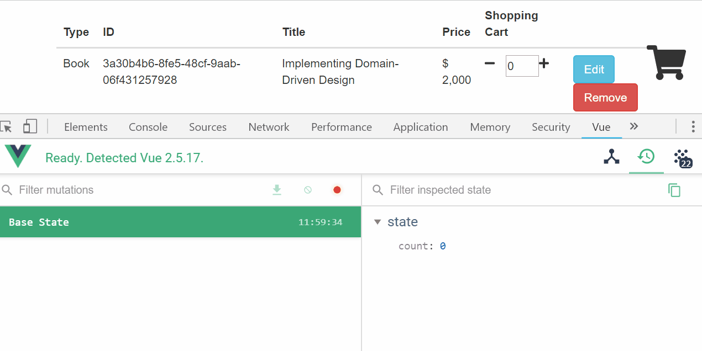

# vuex

> Vue.js官方的狀態管理套件

## Github

[vuejs/vuex](https://github.com/vuejs/vuex)


## 安裝

```
$ npm install vuex --save
```

## 註冊

```javascript
import Vuex from 'vuex'

Vue.use(Vuex);
```

## 開始第一個vuex範例

我們開始撰寫一個簡單的範例，利用vuex來對一個數量變數(`count`)做狀態管理，包含：
* Increment 數量加一 
* Decrement 數量減一
* Reset 數量歸零


- vuex store (myStore.js)

```javascript
import Vue from 'vue';
import Vuex from 'vuex'
Vue.use(Vuex)

export const INCREMENT = 'increment';
export const DECREMENT = 'decrement';
export const RESET = 'reset';

export const store = new Vuex.Store({
    state: {
      count: 0
    },
    mutations: {
      increment (state) {
        state.count++;
      },
      decrement(state){
          if(state.count > 0)
            state.count--;
      },
      reset(state){
          state.count= 0;
      }

    }
})
```

- Usage 

```javascript
import {store, INCREMENT, DECREMENT, RESET} from "myStore";

//Increment
store.commit(INCREMENT);
//Decrement
store.commit(DECREMENT);
//Reset
store.commit(RESET);
```

底下透過[vue-devtools](https://github.com/vuejs/vue-devtools)觀察vuex store的變化；





## 注入vuex store到所有子元件


我們可以使用以下方式開啟注入vuex store到所有子元件(Child components)，可省略在每個Component重複import `myStore.js`:

```javascript
import Vue from 'vue';
import Vuex from 'vuex'
Vue.use(Vuex)

var app = new Vue({
  el: '#app',
  store,
  components: { A, B, C },
})
```

如此可在A,B,C三個components裡面以全域方式取得vuex store：

```javascript
 //Increment
 this.$store.state.count++;
//Decrement
 this.$store.state.count--;
//Reset
 this.$store.state.count=0;
```