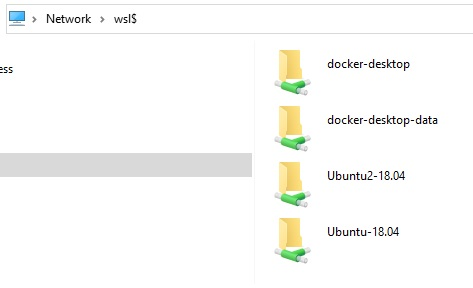

## Set the default WSL version to the distro like this:

```s
$ wsl --set-version Ubuntu-18.04 2
```


## Enter the distro

You can enter the default distro by,

```s
$ wsl
```

Or specify the distro,

```s
$ wsl --distribution[-d] <distro_name> 
```


Or ssh into it, but first we have to know the IP of the distro by

```s
$ ifconfig
```

And set the SSH server, see [[WSL2] ssh into Ubuntu
](https://karatejb.blogspot.com/2020/06/wsl2-ssh-into-ubuntu.html).

Then ssh into it,

```s
$ ssh <user>@<ip> -p <port>
```


## Stop the distro

```s
$ wsl --terminate[-t] <distro_name>
```


## Export and Import

```s
$ wsl --list[-l] --all [-v]
Windows Subsystem for Linux Distributions:
docker-desktop-data (Default)
docker-desktop
Ubuntu-18.04
```


## Export

```s
$ wsl --export <distro_name> D:\Works\Docker\My\WSL2\Backup\wsl2-ubuntu-18.04.tar
```


## Import

The default install directory is at `C:\Users\<user>\AppData\Local\Packages\`.

E.q. My Ubuntu 18.04 is at `C:\Users\<user>\AppData\Local\Packages\CanonicalGroupLimited.Ubuntu18.04onWindows_79rhkp1fndgsc`.


When you import the tar file, it will create the new Distro at the specified path, 

```s
$ wsl --import <distro_name> "C:\Users\<user>\AppData\Local\Packages\Ubuntu" "D:\Backup\wsl2-ubuntu-18.04.tar"
```

You can see current running WSL distros at `\\wsl$` like followig,




## Remove a distro

```s
$ wsl --unregister <distro_name>
```

